<h1 align="center">DECK·7710</h1>

<p align="center">
  <b>Build your own 1-DIN car head unit.</b><br>
  One portable C renderer drives real glass, a browser preview and a PC
  visualiser — the same code, the same dots, on all three.
</p>

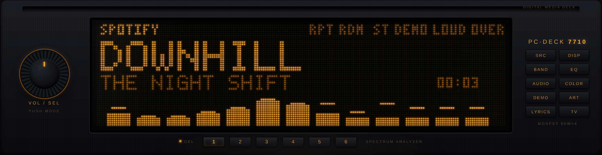

A *deck* is what a head unit is called. This one started as a music visualiser
for a PC and turned into a kit for building the real thing: pick a display,
preview it in a browser before spending money, flash the firmware for your
setup, and slide it into the dash.

Two things live here and both are supported:

|  | What it is | Status |
|---|---|---|
| **The PC deck** | A Pioneer-style faceplate in a browser, fed by whatever your PC is playing | **Working.** This is what most people run |
| **The car deck** | ESP32 + an OLED or VFD panel, Bluetooth audio from your phone | **Renderer verified, firmware written and compiling — but never run on hardware** |

Everything below was rendered by the code in this repo. Nothing is a mockup —
`sh tools/media/make.sh` regenerates the lot.

---

## The screens

Ten display modes, all drawn by `core/` — the same C the firmware runs.

| | |
|---|---|
| **Spectrum analyser** — 13 bands, 63 Hz–16 kHz, peak-hold dots<br>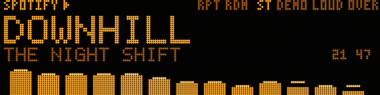 | **Mirror spectrum** — L/R split growing out from centre<br>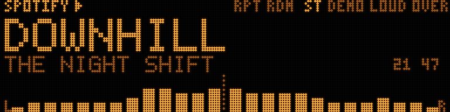 |
| **VU meter** — twin needles with overshoot and recoil<br>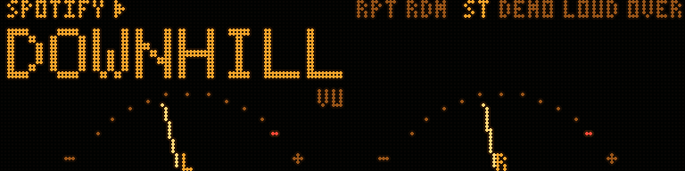 | **Oscilloscope** — dot-matrix scope with phosphor persistence<br>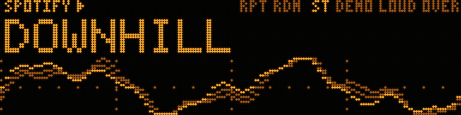 |
| **Cityscape EQ** — coarse tower blocks with a rising scan sweep<br> | **Waterfall** — 32×12 spectral memory climbing upward<br>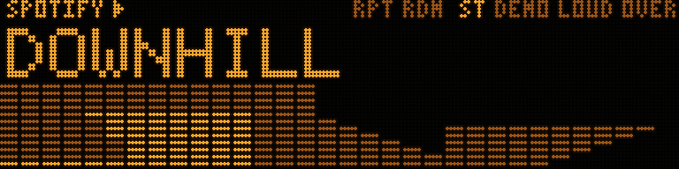 |
| **3D spectrum** — a receding analyser landscape, hidden lines removed<br>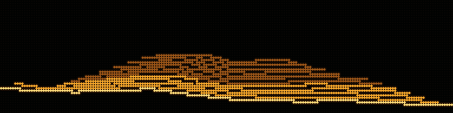 | **Ocean cruise** — the dolphins, and they react to the bass<br>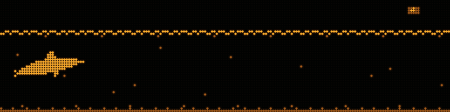 |
| **Album art** — the sleeve, ordered-dithered to four levels<br>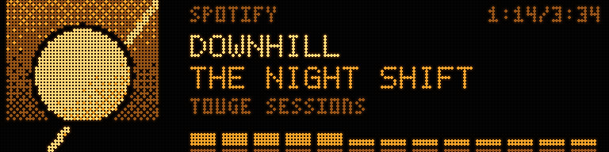 | **Lyrics** — synced from LRCLIB, current line hot<br>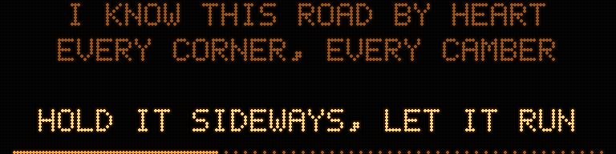 |

## Calls, and the radio

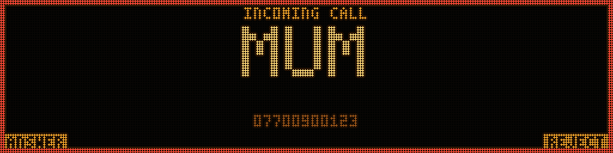

The deck can take hands-free calls: the ESP32 does HFP alongside A2DP, and it
needs one £4 I²S microphone and one spare pin. The caller's name at the largest
size that fits, the border pulsing in a telephone's cadence, and what the
buttons do labelled in the corners — because nobody learns a control layout
while a phone is ringing at them.

| | |
|---|---|
| **In a call** — duration, and a live mic level so you can see they can hear you<br>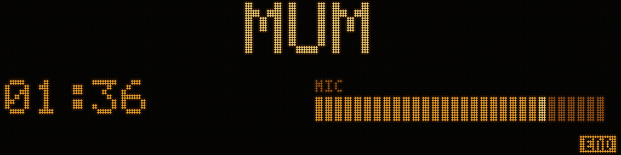 | **Dialling out**<br>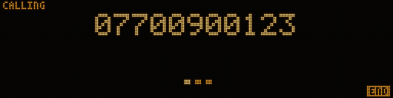 |

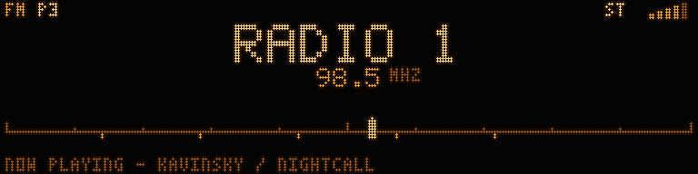

And it is a radio. Station name from RDS first, frequency under it, a band
scale with your presets marked so seeking feels like movement rather than a
number jumping. Signal strength is a *count* of segments and stereo is a glyph
that is there or is not — never brightness, which vanishes on a 1-bit panel.

**Both screens are written and rendered from the real `core/`. Neither driver
is.** [docs/CALLING.md](docs/CALLING.md) and [docs/RADIO.md](docs/RADIO.md) say
exactly what exists, what is designed, and what it costs to build.

<details>
<summary><b>And the whole faceplate</b> — VU, album art, lyrics, waterfall, dolphins</summary>

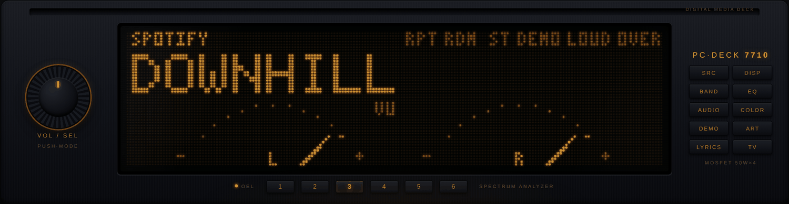
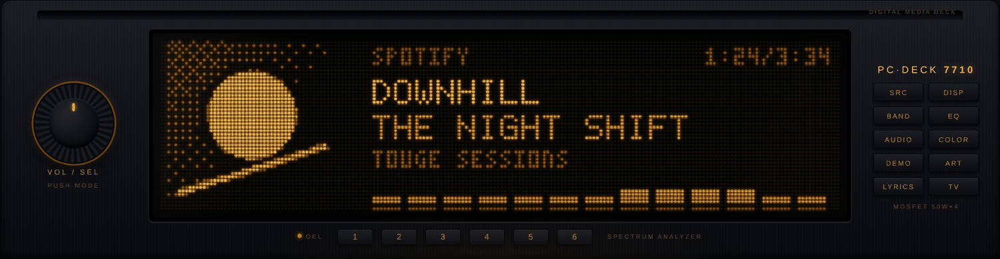
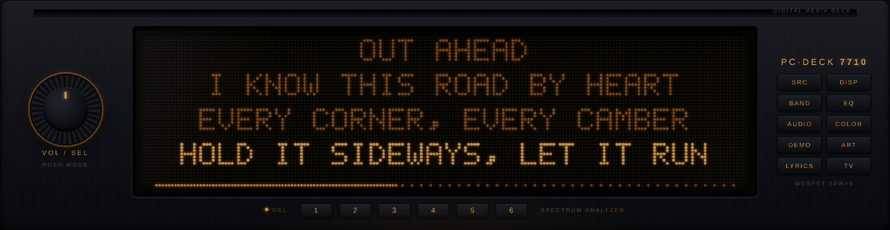
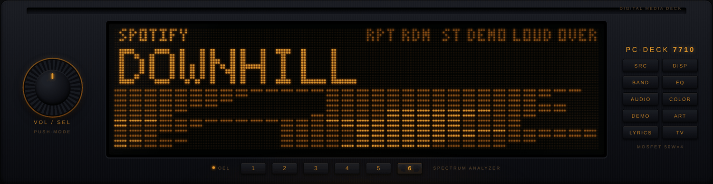
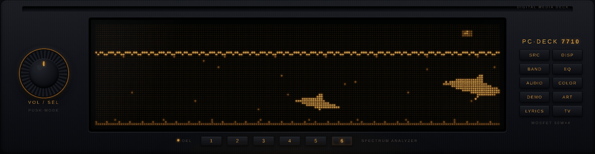

</details>

## The movies

Animations you can make yourself, in pure Python, with no GPU and no Blender.
They play on the PC deck and on the hardware — same file, same decoder.

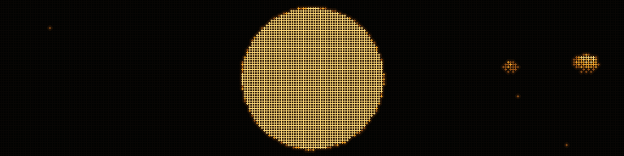

*`SOLAR` — thirteen stops from the Sun to Pluto, with labels drawn from the
deck's own character ROM. `tools/movies/scene_solar.py`.*


*`TOUGE` — a night run lit only by the car's own headlights, where the subject
is the hole in the light. `tools/movies/scene_touge.py`.*

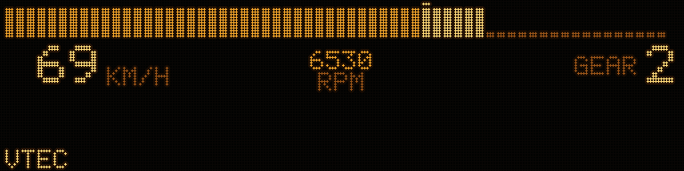

*`VTEC` — a bar tacho, a speed readout and a gear number, because the car this
is drawn from uses a bar rather than a dial and a bar *is* a 4:1 strip. The
revs are a crude engine with load and a limiter, not a sine wave: the
hesitation at the top of a gear is what makes it look like driving.
`tools/movies/scene_vtec.py`.*

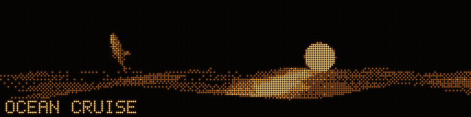

*`DOLPHINS` — the classic screensaver, rebuilt with a real mesh and a real sea.
`tools/movies/scene_dolphins.py`.*


*`SPIN` — the minimal template. Copy `tools/movies/scene_spin.py` and change
the scene; it is deliberately small.*

Already have a GIF or a video? `import_gif.py` and `import_video.py` convert them:

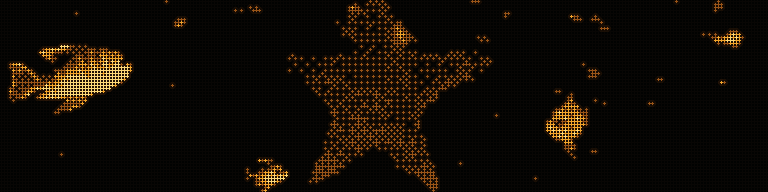

*`import_gif.py reef.gif --cover --keep=25`. Footage needs `--keep`: a camera
uses the whole tonal range and the deck has four levels, so a mid-grey
background does not read as background — it becomes a checkerboard louder than
the subject. Lighting only the brightest quarter drops the water out and hands
all four levels to the fish.*

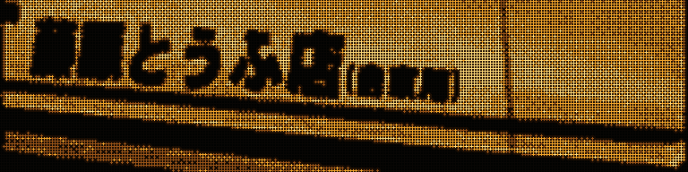

*`import_gif.py ae86.gif --cover --keep=30 --gamma=1.4 --trim=0:62`. A white
car on a dark road is the ideal subject — same reason `TOUGE` works — but the
clip ends by pulling back to a wide, where the car shrinks to a few dots and
the road it is on becomes the brightest thing in frame. `--trim` throws that
away. Look at the source before assuming all of it belongs on a 4:1 panel.*

`import_video.py` takes anything ffmpeg opens, with `--probe` to find the crop,
`--from`/`--dur` to cut a section, and — for the commonest hard case, filming
another display — `--blur` and `--invert`. What that case cannot survive is in
[docs/MOVIE-RENDERING.md](docs/MOVIE-RENDERING.md).

**Making one is a conversation, not a tutorial.** [CLAUDE.md](CLAUDE.md) tells
Claude the constraints — the grid for your panel, the level budget, why thin
bright things dither into noise — so you can describe what you want and get
something that reads on the glass. Full detail in
[docs/MOVIE-RENDERING.md](docs/MOVIE-RENDERING.md).

---

## Run the PC deck

Windows, because it captures WASAPI loopback and Windows media metadata.

```sh
python legacy/server.py          # or double-click start.cmd
```

Opens <http://127.0.0.1:7710>. Play music anywhere — Spotify, YouTube, a game —
and the deck lights up on its own.

- **Audio** — WASAPI loopback of the default output, surviving device switches
- **Track, art, position** — Windows SMTC
- **Lyrics** — [lrclib.net](https://lrclib.net), no account
- **Album art fallback** — the [iTunes Search API](https://performance-partners.apple.com/search-api), only when the player supplies none

Those two lookups are the only things that leave the machine, and both send
just title, artist and album. No audio ever leaves. `LYRICS_ENABLED = False`
and `ART_LOOKUP_ENABLED = False` at the top of `legacy/server.py` turn them off.

### Controls

| | |
|---|---|
| `D` / DISP / knob click | cycle display mode |
| `1`–`9`, `0` | jump to a mode |
| `A` / `L` | album art / lyrics |
| `[` `]` | nudge lyric sync ±0.25 s |
| `V` / `N` | movies / next movie |
| `B` | force the ocean cruise |
| `C` | colour scheme — eight OEM illumination colours |
| `M` | demo: auto-cycle everything |
| `T` | TV mode — fullscreen the display only |
| `F` | fullscreen the whole faceplate |

**Idle behaviour, faithful to the era:** music stops → 3 s → clock; 12 s → the
dolphins take over; music returns → a hard horizontal wipe back to the
analyser. On every track change the album art is dithered to a 3-tone bitmap
and shown as a NOW PLAYING interstitial for two seconds.

## Preview a panel you have not bought

```sh
sh tools/serve.sh          # http://127.0.0.1:7720
```

Compiles `core/` to WASM and emulates any panel: grid size, level count, dot
shape, illumination colour. Because it is the same C the firmware runs, what
you see is what the glass does — not an artist's impression of it.

## Run the deck itself, without a deck

```sh
sh tools/sim/run.sh                      # 20 seconds of deck, as ASCII
sh tools/sim/run.sh --gif /tmp/deck.gif  # ...as an animation
sh tools/sim/run.sh --grid 192 48 --levels 2    # on a 1-bit VFD you do not own
```

The preview above runs `core/`. This runs the layer above it — the firmware's
own `deck_ui.c`, unmodified, against stub drivers. Which screen is on, when the
deck gives up and shows the clock, how a track change interrupts, what a movie
does at its last frame: all of it, on a laptop, in about a second.

```sh
python3 tools/sim/test_behaviour.py      # 20 assertions about what it does
```

It is not a simulation of the hardware, and
[docs/TESTING.md](docs/TESTING.md) is explicit about which questions it cannot
answer — SPI timing, the Bluetooth stack, a supply that sags on crank. Those
fail on hardware and only on hardware.

## Build the hardware

**[docs/BUILD.md](docs/BUILD.md) is the end-to-end guide** — shopping list with
part numbers, pin-by-pin wiring, flashing, pairing, building it into a case,
and the car install last.

The shopping list covers **the mechanical half too** — donor chassis, cage,
rear support strap, nylon standoffs, nyloc nuts, panel-mount sockets, wire,
crimps, anti-rattle foam and the tools — with quantities. That is the half
nobody lists and the half a build stalls on.

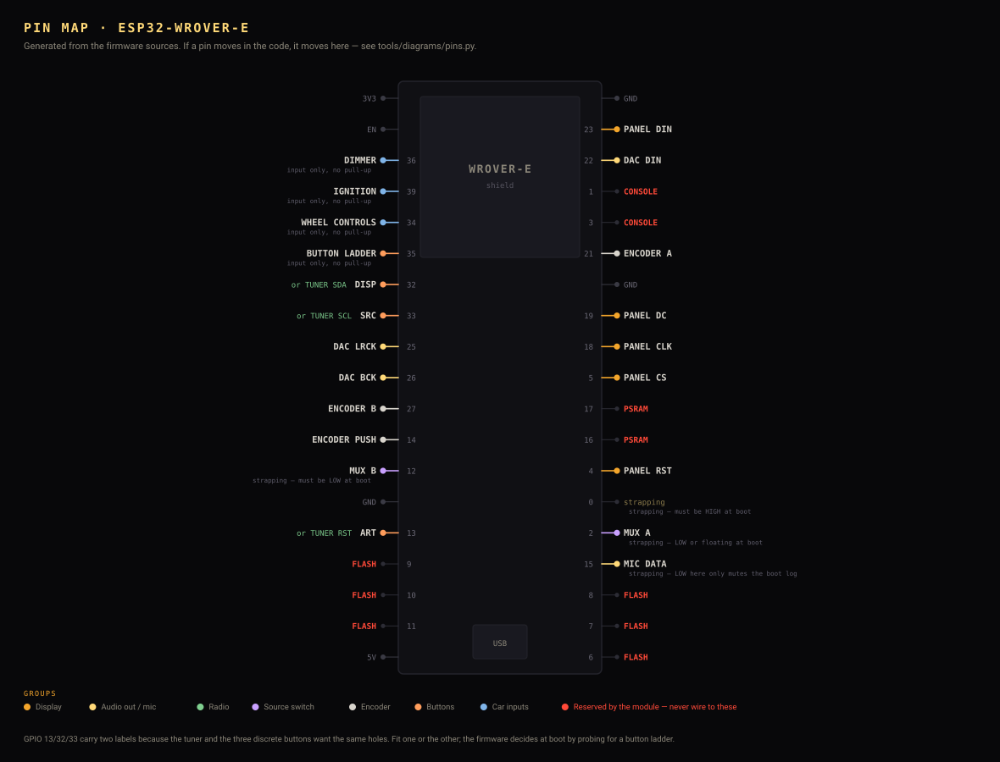

*The pin map is **generated from the firmware**, not drawn next to it. It is
parsed out of the `#define PIN_...` lines, it refuses to draw a GPIO claimed by
two drivers, and CI fails if the picture and the code disagree — because the
person reading a wiring diagram is holding a soldering iron.*

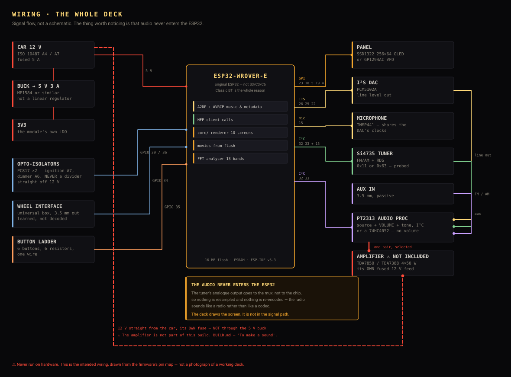

*The audio never enters the ESP32. The tuner's analogue output and the aux
socket go to a 74HC4052, and the chip only selects which pair reaches the
amplifier — nothing is resampled and nothing is re-encoded.*

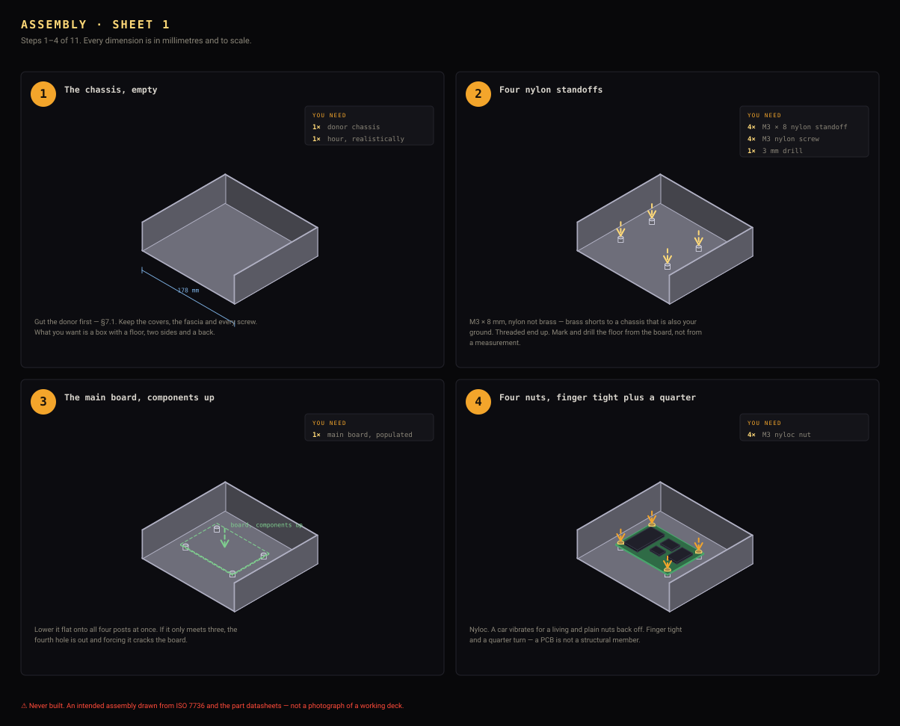

*The mechanical build is **eleven steps, drawn** — one action each, the parts
for that step boxed in the corner with quantities, the new part ghosted where
it goes. Isometric and to scale in millimetres, so you can measure the drawing.
Sheets [1](docs/media/assembly-sheet1.svg) ·
[2](docs/media/assembly-sheet2.svg) · [3](docs/media/assembly-sheet3.svg), or
the same thing as [one exploded stack](docs/media/assembly.svg).*

*Also [dimensions](docs/media/dimensions.svg) — 182 × 53 mm at the face, and
what has to clear behind it. ⚠️ Drawings of an intended build, from the
standard and the datasheets. Nothing here has been assembled.*

### Where the chassis comes from

You do not fabricate a 1-DIN box — you gut a scrap head unit, and **you buy a
broken one on purpose**. The CD mechanism, the amplifier and the tuner all go
in the bin on the first evening, so a jammed unit at £8 is worth exactly as
much to you as a working one at £40.

**[docs/DONORS.md](docs/DONORS.md)** grades five routes and draws, to scale,
whether the deck's panel fits behind each one's window:

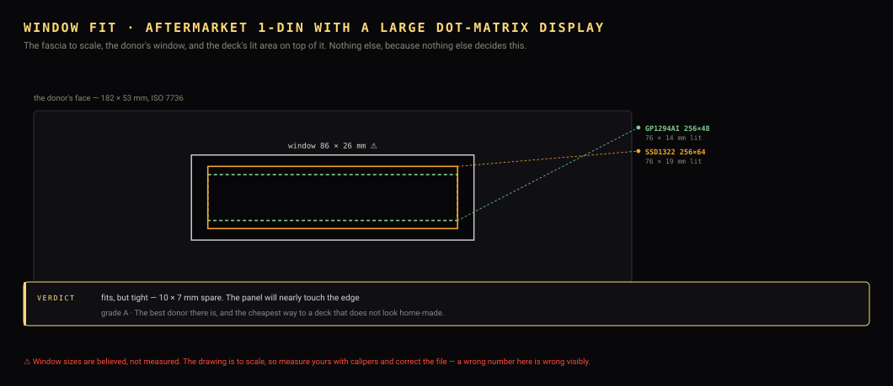

*The best donors are 1998–2008 units with a big amber dot-matrix display —
their window is already a wide letterbox of about the right size, in about the
right place, in the right colour.*

**Thirty-one units are named**, each flagged ✅ buy it / ⚠️ read the note / ❌
avoid. The short list to search for: **Pioneer DEH-P9000R** and **DEH-P9100R**
(the OEL originals), their **MEH-** MiniDisc twins — same fascia, a fraction
of the price because MiniDisc is worthless — **DEH-P6600**, **DEH-P6800MP**,
**DEH-P6300**, **DEH-P9400MP**, **Alpine CDA-9855R** and **CDA-9887R**, and
**Blaupunkt Bremen MP76**.

❌ Avoid anything with a **motorised or dual faceplate** — DEH-P85BT,
Clarion DXZ925, Kenwood KDC-716S. The mechanism eats depth and is one more
thing to defeat.

⚠️ And a VFD donor's power board makes tens of volts and holds them after
power-off. That hazard is real and it is on the page.

```sh
python3 tools/deckctl.py donor --full   # grade them, with the model numbers
```

**Or buy nothing second-hand at all.** A **new empty 1-DIN pocket** — the ABS
tray sold to fill the hole a removed radio leaves — is £6–12, already exactly
the right size, comes with a fascia and a bezel, and has no laser, no inverter
and nothing charged in it. You cut your own window in fresh plastic and fit
your own buttons. It is the closest thing that exists to a "blank" head unit,
and it is cheaper than most broken ones.

⚠️ **There is no 1-DIN head unit sold as a programmable platform.** Real ones
run locked firmware on proprietary SoCs with no published toolchain — there is
nothing to flash to. Android 1-DIN units and projects like PILOT Drive and
OpenAuto exist and are worth reading, but they are different machines running
different stacks. [TRANSPLANT.md §3](docs/TRANSPLANT.md) lays the options out.

### Moving the parts across

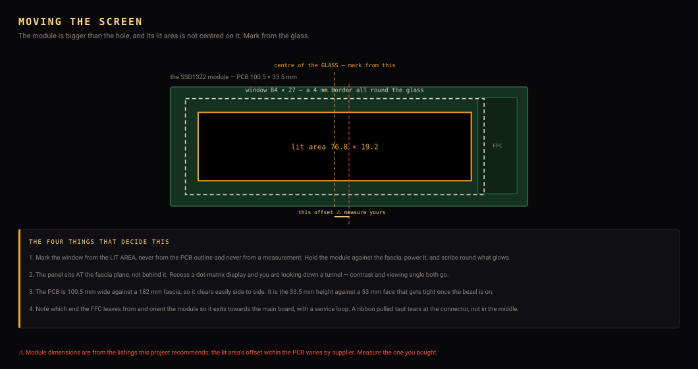

*The module is bigger than the hole and **its lit area is not centred on it** —
a 3.12" SSD1322 board is 100.5 × 33.5 mm and only 76.8 × 19.2 mm of that
glows. Mark the window from the glass and the deck looks bought; mark it from
the PCB and it is permanently a few millimetres out.*

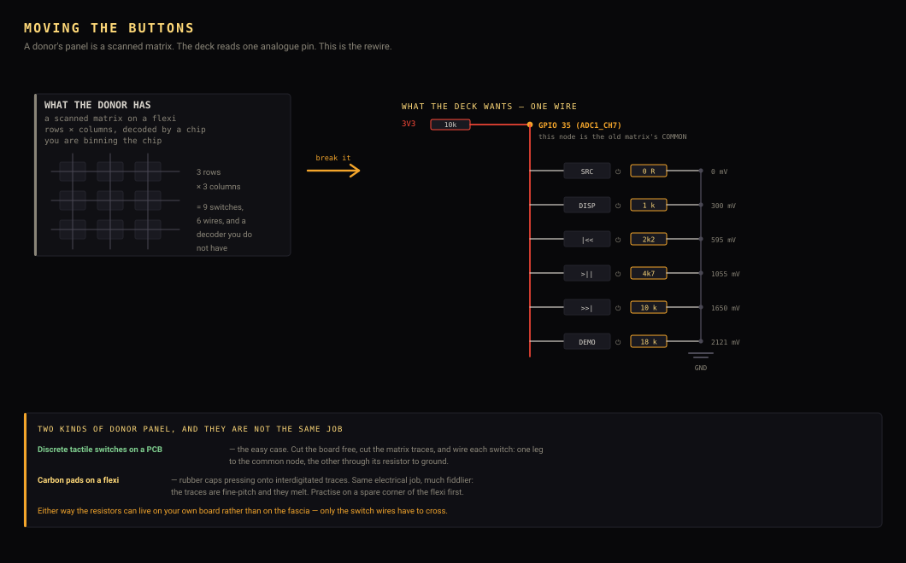

*A donor's panel is a scanned matrix; the deck reads one analogue pin. So the
rewire is a **subtraction** — you never need to work out the original scanning
order. [TRANSPLANT.md](docs/TRANSPLANT.md) has the rest: mounting the panel at
the fascia plane rather than behind it, fitting the knob to an EC11 shaft, and
reusing the fascia's light pipes.*

### What YOUR car needs

The deck is the same object in every car. What changes is a bag of adapters —
something to fill the hole, something to reach the car's connector, something
to reach its aerial — and how much room is behind the dash.

**[docs/VEHICLES.md](docs/VEHICLES.md)** covers the Honda S2000 (AP1, AP2), the
Mazda MX-5 (NA, NB, NC, ND) and the Toyota MR2 (W10, W20, W30), and
`vehicles/` is a JSON file per car so adding one is a pull request rather than
a rewrite.

```sh
python3 tools/deckctl.py fit s2000 ap1    # your car's kit, at the bench
```

⚠️ **The radio region follows where you drive, not where the car was built.** A
JDM import in Britain receives British stations. Japan's FM band is 76–95 MHz
against Europe's 87.5–108, and the Americas use 10 kHz AM spacing against 9 kHz
elsewhere — get it wrong and most of the band is missing or mistuned.

One tool does the whole loop:

```sh
python3 tools/deckctl.py            # guided: check, build, flash, load movies
```

```sh
python3 tools/deckctl.py doctor     # what is plugged in, and does it work
python3 tools/deckctl.py build      # compile for your panel
python3 tools/deckctl.py flash      # firmware onto the deck
python3 tools/deckctl.py movies     # choose animations, write them to flash
python3 tools/deckctl.py pictures *.jpg   # your own photographs
python3 tools/deckctl.py logs       # watch it run
python3 tools/deckctl.py coredump   # why it crashed
```

`doctor` reads the chip ID off the board, which catches the most expensive
mistake here: an ESP32-S3 cannot do A2DP and looks identical in a listing.

**When it does not work:** [docs/DIAGNOSTICS.md](docs/DIAGNOSTICS.md). The deck
runs a four-stage self-test at every boot, in an order where each stage can
only fail for reasons the previous ones ruled out — so a blank panel at stage 1
is hardware and a blank panel after stage 1 is software.

Then [docs/HARDWARE.md](docs/HARDWARE.md) for the full component survey, where
every claim is marked ✅ verified against a datasheet or listing, or ⚠️ not, and
[docs/HANDBOOK.md](docs/HANDBOOK.md) for the tiers and bring-up order.

| Tier | Display | Brain | Rough cost |
|---|---|---|---|
| Bench | SSD1322 OLED 256×64, 16 grey | ESP32-WROVER-E | ~£32 |
| Car — greyscale | SSD1322 | ESP32-WROVER-E | ~£82 |
| Car — authentic VFD | Futaba GP1294AI, 1-bit | ESP32-WROVER-E | ~£92 |
| Car — colour ⚠️ | 4.58" bar IPS, 960×320 | ESP32 **+ ESP32-S3** | ~£90 |

Two corrections already made the hard way, so you do not have to:

- **It must be the original ESP32, not the S3.** The S3 has no Bluetooth
  Classic, so no A2DP, so no audio from a phone. Espressif closed that request
  "Won't Do".
- **The 8.8" bar LCD does not fit a 1-DIN slot** — ~217 mm wide against a
  180 mm fascia. There *is* a colour panel that fits; see
  [HARDWARE.md §1b](docs/HARDWARE.md).

---

## How it holds together

```
                     ┌── WASM ─────► browser preview (emulates any panel)
   core/  (C99) ─────┼── ESP32 ────► car firmware
                     └── Linux/Pi ─► firmware
   legacy/ (JS)  ───────────────────► the PC deck
```

`core/` is C99 with no libc, no libm, no allocation and no floating-point
surprises — it ships its own trig so a dolphin breaches on the same frame in
V8, glibc and on an ESP32. Screens write intensity levels 0–4; a per-target
output stage decides what a panel shows, whether that is 16 greys, a 1-bit
Bayer dither or an RGB palette.

### The one rule

**`core/` is verified against the JavaScript it was ported from.**

```sh
sh tools/verify/run.sh
```

Both implementations render the same input and the framebuffers are diffed:
fonts, every screen, text handling, metadata screens, the ocean, and every
movie decoded three ways. If you change a screen's output on purpose the diff
fails — **update the expectation, never delete the case.**

This is not ceremony. It has caught a dolphin breaching one frame early,
waterfall thresholds landing differently at double precision, and text
dithering into mush on 1-bit panels.

## What is in here

| Path | |
|---|---|
| `legacy/` | The PC deck. Python server + JS faceplate. Moves slowly and deliberately |
| `core/` | The portable renderer. C99, no deps, no allocation |
| `preview/` | `core/` as WASM, emulating any panel in a browser |
| `firmware/esp32/` | The car deck. Written and compiling — **never run on hardware** |
| `tools/deckctl.py` | Build, flash, load movies and pictures, read logs and crashes |
| `tools/movies/` | The animation maker: 3D renderer, GIF and photo importers, `.dmv` packer |
| `tools/verify/` | The differential test suite |
| `tools/sim/` | The deck's own firmware, running on your computer |
| `tools/media/` | Regenerates every picture in this README |
| `docs/` | Handbook, hardware, architecture, UI spec, control, versioning |

## Status, honestly

| | |
|---|---|
| PC deck | Working, in daily use |
| `core/` renderer | Complete, all ten screens, verified against the JS |
| Browser preview | Working |
| Movie tooling | Working — 3D scenes, GIF import, flash packing |
| ESP32 firmware | **Written and compiles.** A2DP + AVRCP, hands-free calling, Si4735 radio, three-way source switching, FFT analyser, SSD1322 and VFD drivers, movies from flash, self-test and diagnostics. 1.75 MB image, ESP-IDF v5.3, both 8 MB and 16 MB flash. **Never run on hardware** |
| Flash tooling | Working — `deckctl` does build, flash, content and logs |
| Calling | Screens **written and rendered** from `core/`; HFP client **written** (`deck_hfp.c`), microphone on the I²S clocks. ⚠️ Never met a phone; mic specified, not bought |
| Radio | Screen **written and rendered** from `core/`; Si4735 driver **written** (`deck_tuner.c`) with tune, seek, RDS and presets. ⚠️ Never met a tuner; part specified, not bought |
| Sources | Bluetooth / radio / aux through a 74HC4052 — **written** (`deck_source.c`). Audio never enters the ESP32. ⚠️ Never wired |
| Colour panel | Researched, part identified, ⚠️ nothing bought or wired |

## Docs

[Build guide](docs/BUILD.md) · [Diagnostics](docs/DIAGNOSTICS.md) ·
[Safety](SAFETY.md) · [Handbook](docs/HANDBOOK.md) · [Hardware](docs/HARDWARE.md) ·
[Architecture](docs/ARCHITECTURE.md) · [UI spec](docs/UI-SPEC.md) ·
[Making animations](docs/MOVIE-RENDERING.md) · [Control](docs/CONTROL.md) ·
[Buying guide](docs/BUYING.md) · [Your car](docs/VEHICLES.md) ·
[Calling](docs/CALLING.md) · [Radio](docs/RADIO.md) ·
[Testing](docs/TESTING.md) · [Versioning](docs/VERSIONING.md) ·
[For Claude](CLAUDE.md)

---

## Before you wire anything to a car

> **This is an unfinished hobby project published as source, not a product.**
> Nothing here has been tested in a vehicle, certified by anyone, or approved
> for road use. The firmware has never run on hardware. If you build one, you
> are the manufacturer, and every consequence is yours — including fire,
> battery drain, airbag circuits, driver distraction, insurance and type
> approval.
>
> **Read [SAFETY.md](SAFETY.md) first.** It is short, specific, and lists the
> things that actually go wrong.

Everything in this project can be built and run on a desk from USB before any
of it goes near a dashboard, and the handbook is ordered so that it is.

---

Co-designed with GPT 5.6 (Sol) — the visual spec, the meter ballistics and the
album-art dither idea came out of that consult.

Contributions welcome — see [CONTRIBUTING.md](CONTRIBUTING.md).

MIT licensed — see [LICENSE](LICENSE), [NOTICE](NOTICE) and [SAFETY.md](SAFETY.md).
Build one.
