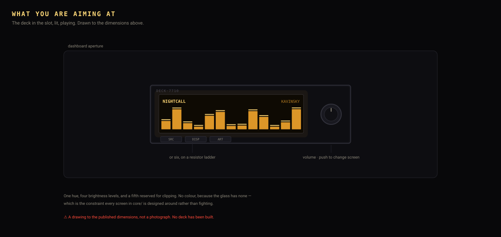
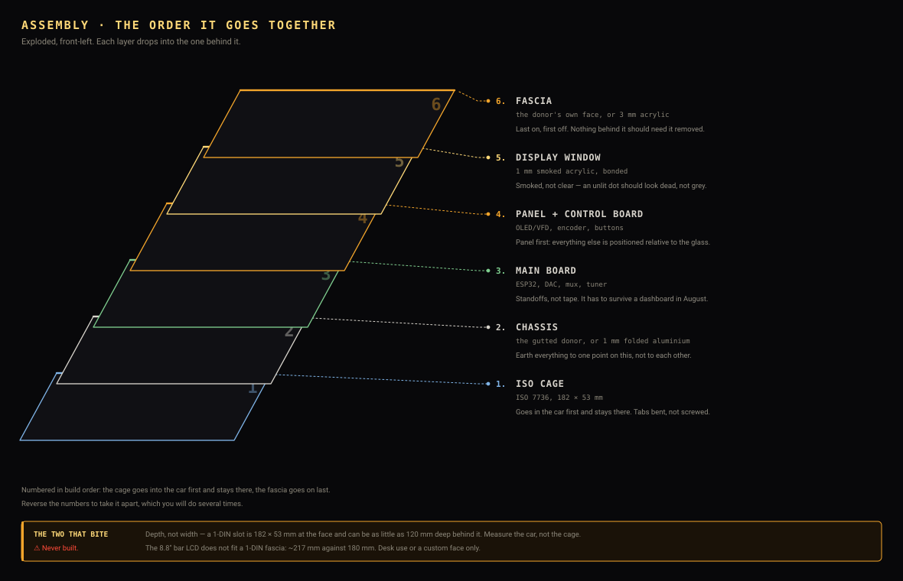
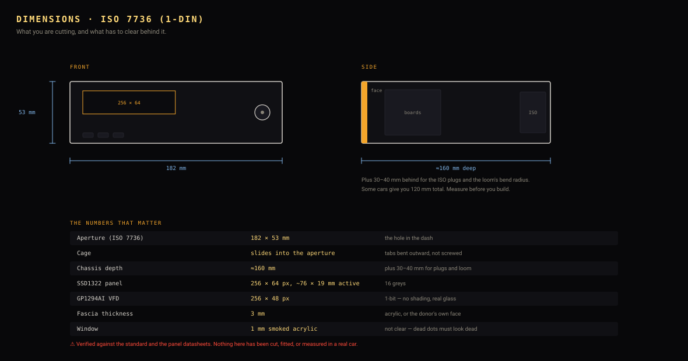

# Building a DECK·7710, end to end

From nothing to a head unit playing music off your phone.

> **Read [SAFETY.md](../SAFETY.md) before any of this goes in a vehicle.** The
> firmware has never run on hardware. Steps 1–6 happen on a desk from USB and
> risk nothing but your own time; step 8 is where a car is involved and where
> the consequences change.

Work through it in order. Each stage can only fail for reasons the previous
stages have ruled out, which is what makes it debuggable.



---

## The five drawings

Everything below is also drawn. **These are generated, not sketched** — the pin
map is parsed straight out of the firmware's own `#define PIN_...` lines, so it
cannot quietly stop describing the code. If a pin moves in `deck_input.c`, it
moves here or `sh tools/verify/run.sh` fails.

| Drawing | Answers |
|---|---|
| [Pin map](media/pinmap.svg) | which hole this wire goes in |
| [Wiring](media/wiring.svg) | what connects to what, and what never touches the ESP32 |
| [Assembly](media/assembly.svg) | what order it goes together in |
| [Dimensions](media/dimensions.svg) | will it fit, and what am I cutting |
| [Finished](media/finished.svg) | what I am aiming at |

⚠️ They describe an **intended** build. No deck has been assembled, so these
are drawings from the datasheets and the standard, not photographs of a
working unit.

---

## 0. What you are building

An ESP32 that pretends to be a pair of Bluetooth speakers. Your phone connects
to it in the normal Bluetooth menu with no app and no pairing code, plays music
to it, and the deck shows the analyser, the track, the lyrics and the dolphins
on a dot-matrix panel — then passes the audio out to an amplifier.

```
   phone ──Bluetooth A2DP──►  ESP32  ──I2S──►  DAC ──► amplifier ──► speakers
                               │  │
                     AVRCP ────┘  └──── SPI ──► the panel
              (title, artist,              (SSD1322 or VFD)
               position, transport)
```

---

## 1. The shopping list

Prices are ⚠️ approximate and move; part numbers are ✅ checked against a
datasheet or a live listing. Full survey and alternatives in
[HARDWARE.md](HARDWARE.md); **where to actually buy each thing, and in what
order, is [BUYING.md](BUYING.md)**.

⚠️ **Check the flash size before you buy a board.** A 16 MB WROVER is easy to
get as a bare module and hard to get as a board with pins on it, and most
assembled boards are 8 MB. That is fine — build with `--flash 8` — but it is
the one decision that is annoying to change later. [BUYING.md §0](BUYING.md#0-the-one-decision-that-affects-what-you-order).

### First decide the panel, because everything else follows from it

| Want | Buy | ~Cost | What you get | What it costs you |
|---|---|---|---|---|
| **Just make it work** | **SSD1322 OLED 256×64** ✅ | £16–23 | 16 greys, so all four intensity levels survive. Exactly 4:1, fits 1-DIN with room. Driver written and building | Nothing. **This is the recommended build** |
| **The period look** | Futaba GP1294AI VFD 256×48 ✅ | £15–40 | Real vacuum fluorescent — unbeatable in daylight, and genuinely the technology the original decks used | 1-bit. Everything dithers; thin bright detail turns to noise. ⚠️ Confirm the filament/anode supply before ordering |
| **Colour** | 4.58" bar IPS TFT 960×320 ✅ **+ a second chip** | £14 + £8 | Full colour, fits 1-DIN with 60 mm spare, and level 4 finally renders red like the core always said it would | **Two microcontrollers.** The panel needs a parallel RGB bus; the original ESP32 has no RGB peripheral, and the chips that do cannot do A2DP. ⚠️ No firmware for this yet — [HARDWARE.md §1b](HARDWARE.md#1b-colour--yes-and-here-is-the-exact-catch) |
| **A big desk display** | 8.8" bar LCD 1920×480 | £50–70 | Enormous, and the legacy PC deck drives it today with no firmware at all | ⚠️ **~217 mm wide — it does not fit a 1-DIN slot.** Desk use or a custom fascia |

If you do not have a strong reason, take the first row. It is the cheapest, the
easiest to drive, and the only one where the deck looks the way it was designed
to look.

### The bench build — everything you need to see it work (~£35)

| # | Part | Why this one | ~Cost |
|---|---|---|---|
| 1 | **ESP32-WROVER** dev board, PSRAM, **8 or 16 MB flash** ✅ | The *original* ESP32. Nothing else has Bluetooth Classic, so nothing else can receive audio, and WROVER is for the PSRAM the framebuffers need. 16 MB is the recommended layout; 8 MB builds with `--flash 8` and is what most assembled boards actually are | £8–14 |
| 2 | **SSD1322 OLED, 256×64**, SPI, module ~100.5 × 33.5 mm ✅ | The only panel that keeps all four intensity levels. Yellow variant reads as amber | £16–23 |
| 3 | Jumper wires, breadboard | | £3 |
| 4 | USB data cable | Charge-only cables look identical and waste an hour | — |

That is a complete, working deck on a desk. Everything below adds a car.

### To hear it (~£8)

| # | Part | Why | ~Cost |
|---|---|---|---|
| 5 | **PCM5102A** I2S DAC board ⚠️ | Line-out to any amplifier. The ESP32's internal DAC is 8-bit and audibly bad | £5 |
| 6 | 3.5 mm socket or RCA pair | | £3 |

### To use it (~£12)

| # | Part | Why | ~Cost |
|---|---|---|---|
| 7 | **Rotary encoder with push**, EC11 type ⚠️ | Dim, and push to change screen | £2 |
| 8 | 3 × momentary tactile buttons | SRC, DISP, ART — all the pins a WROVER-E has left. See §3 | £1 |
| 8b | *or* 6 buttons + a resistor ladder: 1 kΩ, 2.2 kΩ, 4.7 kΩ, 10 kΩ, 18 kΩ, plus one 10 kΩ pull-up | The full fascia on one ADC pin. Also how you reuse a donor deck's own front panel | £3 |
| 9 | 3.5 mm TRS socket + 10 kΩ resistor | Steering wheel control input. See below | £2 |
| 10 | **Steering wheel interface box** ⚠️ | Only if you want the wheel buttons. Universal (PAC SWI-RC-1, Metra ASWC-1) or S2000-specific (InCarTec 29-629) | £30–45 |

### To take calls and listen to radio (~£20, both optional)

| # | Part | Why | ~Cost |
|---|---|---|---|
| 10a | **INMP441** I²S MEMS microphone ✅ | Hands-free calls. Shares the DAC's clocks, so it costs one wire. See [CALLING.md](CALLING.md) | £4 |
| 10b | Thin 4-core cable, 1.5 m | The mic wants to be at the A-pillar pointing at your face, not behind the fascia pointing at the dashboard | £3 |
| 10c | **Si4735** tuner module ✅ | FM **and** AM, with RDS. Uses the three pins the button ladder freed. See [RADIO.md](RADIO.md) | £8–14 |
| 10d | **74HC4052** analogue mux + socket | Selects Bluetooth / radio / aux into the amplifier, so the radio never enters the ESP32's audio path | £1 |
| 10e | **TSOP38238** IR receiver ⚠️ | Only if you want a remote, and only fits with the ignition/dimmer resistor network — [HARDWARE.md §5c](HARDWARE.md#5c-the-remote-control-aux-and-usb) | £1 |

### To put it in a car (~£30)

| # | Part | Why | ~Cost |
|---|---|---|---|
| 11 | **Buck converter**, 9–18 V → 5 V, ≥3 A, automotive-rated ⚠️ | A car's 12 V rail is neither 12 V nor clean | £6 |
| 12 | **PC817** opto-isolator + 4.7 kΩ ⚠️ | Ignition sense. **Never** feed car 12 V to a GPIO through a divider | £1 |
| 13 | **ISO 10487 harness adapter** for your car ✅ | Turns the whole install into plug-in work | £6 |
| 14 | Inline fuse holder + fuses | See SAFETY.md. Not optional | £3 |
| 15 | **DIN aerial adapter** for your car ✅ | Only with the tuner fitted. If your car's aerial is amplified you need one **with 12 V phantom power** or the tuner is deaf. An S2000's mast is not amplified, so a plain adapter does | £6–12 |

The case, the cage, the fasteners and the wire are all below — and they are the
half of a build that gets forgotten.


### The mechanical bits — the ones everybody forgets

This is the section that does not exist in most build guides and is the reason
a project stalls on a Sunday afternoon. **Buy all of it at the start.** None of
it is expensive and every single item will stop you dead if it is missing.

#### The case and getting it into the dash

| # | Part | Qty | Why | ~Cost |
|---|---|---|---|---|
| M1 | **Donor 1-DIN head unit, dead** ⚠️ | 1 | Chassis, fascia, trim ring, cage, and all the fiddly mounting hardware — none of which is sold separately. See [HARDWARE.md §7](HARDWARE.md#7-enclosure--and-the-answer-is-a-donor-deck) | £10–25 |
| M2 | **DIN cage**, ISO 7736 ✅ | 1 | Usually comes with the donor. Buy separately only if it does not | £5 |
| M3 | **Removal keys** ✅ | 1 pr | You need these to get the *old* radio out of the car as well as yours back out later | £3 |
| M4 | **Fascia/trim adapter for your car** ✅ | 1 | Car-specific. An S2000 takes a single-DIN plate with a pocket below | £8–15 |
| M5 | Rear support strap | 1 | Most cars have a threaded stud at the back of the aperture. The donor's own strap fits it. **Use it** — a deck held only at the front works on the cage tabs until they let go | £2 |

#### Fasteners

Buy assortment boxes rather than counting screws. The whole lot is under £20
and you will use it on the next project too.

| # | Part | Qty | Why | ~Cost |
|---|---|---|---|---|
| M6 | **M3 × 6/8/10 mm machine screws + nuts**, assortment | ~20 | Mounting boards to the chassis | £5 |
| M7 | **M3 nylon standoffs**, male-female, 6 and 10 mm | ~12 | Boards must not touch a steel chassis. Nylon, not brass — one shorted trace against a grounded chassis is the whole build | £5 |
| M8 | **M2.5 × 6 mm screws + nuts** | ~8 | Display modules use M2.5, not M3. Ordering only M3 costs you a second order and a week | £3 |
| M9 | **M3 nyloc nuts** | ~10 | For anything structural. A car vibrates continuously for years and a plain nut will walk off | £3 |
| M10 | **M3 shakeproof + plain washers** | ~20 | Same reason | £2 |
| M11 | **Medium-strength threadlock** (blue) | 1 | For screws you cannot fit a nyloc to. Blue, not red — red means you are never taking it apart again | £4 |

#### Fascia and panel

| # | Part | Qty | Why | ~Cost |
|---|---|---|---|---|
| M12 | **Knob for the encoder**, 6 mm D-shaft | 1 | An EC11 ships with a nut and washer and **no knob**. The donor's own volume knob usually fits, which is worth checking before buying | £2 |
| M13 | **Tactile switches, 6 × 6 mm, tall stem** (9–13 mm) | 6 | The stem has to reach the fascia. Standard 4.3 mm ones sit 5 mm short and nothing you do afterwards fixes that | £3 |
| M14 | **Panel-mount 3.5 mm stereo sockets** + nuts | 2–3 | Steering wheel input, aux in, mic. Panel-mount, not PCB — they take the strain of a plug being pulled | £4 |
| M15 | **Panel-mount USB-C breakout** | 1 | Flashing and logs from the front, without pulling the deck out | £4 |
| M16 | **Clear polycarbonate sheet, 1 mm** | A5 | The display window. Polycarbonate, not acrylic — acrylic cracks when you drill it | £4 |
| M17 | **Smoked/ND film or dark tint** ⚠️ | 1 | Optional and transformative. Ambient light crosses the filter twice — in, and again on the way back out after reflecting — while the panel's own light crosses it once. So it kills reflections far harder than it kills the picture. Every OEM deck's window is dark for this reason | £5 |

#### Wiring and joining

| # | Part | Qty | Why | ~Cost |
|---|---|---|---|---|
| M18 | **22 AWG stranded hookup wire**, several colours | 10 m | Signal. Stranded, never solid — solid core work-hardens and snaps where it vibrates | £8 |
| M19 | **18 AWG stranded**, red and black | 3 m | Power in and ground | £5 |
| M20 | **JST-XH or Dupont crimp kit** + crimp tool | 1 | So the fascia unplugs from the chassis. You will take it apart more times than you expect | £12 |
| M21 | **Heat-shrink assortment** | 1 | Every joint | £5 |
| M22 | **Spade + bullet terminals** | ~20 | Only if you are wiring an ISO plug yourself rather than using an adapter | £4 |
| M23 | **Cable ties + adhesive tie mounts** | 1 pk | A loose loom inside a chassis will chafe through in a year | £3 |
| M24 | **Self-adhesive neoprene foam strip, 3 mm** | 1 m | Anti-rattle, between the fascia and the chassis. This is the difference between a deck that feels OEM and one that buzzes over every expansion joint | £4 |
| M25 | **VHB double-sided foam tape** | 1 | Mounting the display without drilling its PCB | £5 |
| M26 | Solder, flux, Kapton tape | | | £8 |

#### Tools, if you do not have them

| Tool | Note |
|---|---|
| Soldering iron | Temperature-controlled if possible. You are soldering to a steel chassis ground at one point and it will suck heat |
| **Multimeter** | **Not optional.** You will meter the ISO harness before connecting it, and that step is the one that prevents an expensive mistake |
| Wire strippers, side cutters, crimp tool | |
| Small files and a step drill | For the display aperture and the panel-mount sockets. A step drill makes a clean round hole in thin steel; a twist drill grabs and tears |
| Deburring tool or a round file | Every hole you cut in steel gets a sharp edge, and every wire that passes through it will find that edge eventually |

**Rough total for the mechanical side: £90–120**, most of it reusable, and
about half of it tools you keep.

### Instead of the OLED, if you want real VFD glass

| Part | Trade | ~Cost |
|---|---|---|
| **Futaba GP1294AI**, 256×48 ✅ | Genuinely the period technology, unbeatable in daylight. Costs you the greyscale — everything dithers to 1-bit. ⚠️ **Confirm the filament and anode supply before buying**; see HARDWARE.md §1 | £15–40 |

---

## 2. Get the tools

```sh
git clone https://github.com/JonoGitty/pc-deck-7710.git
cd pc-deck-7710
python3 tools/deckctl.py doctor
```

`doctor` tells you what is missing and exactly how to get it. The big one is
ESP-IDF, about 2 GB, once:

```sh
git clone -b release/v5.3 --recursive https://github.com/espressif/esp-idf.git ~/esp/esp-idf
~/esp/esp-idf/install.sh esp32
. ~/esp/esp-idf/export.sh
```

That last line has to be run **in every new terminal**. Forgetting it is the
commonest first failure and the error it produces does not say so.

`doctor` also reads the chip ID off the board, which catches the single most
expensive mistake in this project: an ESP32-S3 cannot do A2DP at all, and
looks identical in a listing.

---

## 3. Wire it

Pin numbers are GPIO numbers, and they match the firmware — not by discipline
but by construction: the pin map below is generated from the `#define PIN_...`
lines in `firmware/esp32/main/` and `components/deck_display/`, and CI fails if
the picture and the code disagree.


**The one thing to take from that drawing:** the audio does not go through the
ESP32. The tuner's analogue output and the aux socket both go to the 74HC4052,
and the chip only picks which pair reaches the amplifier. Nothing is resampled
and nothing is re-encoded.

### The pin map


Three things on it are worth reading twice:

- **Red pins are the module's, not yours.** Flash, PSRAM, and the console.
- **GPIO 13, 32 and 33 carry two labels.** The tuner and the three discrete
  buttons want the same three holes; you fit one or the other, and the
  firmware works out which at boot.
- **`strapping` is not the same as `free`.** Those pins are sampled during
  reset, so the requirement is about what they read at power-on, not what they
  do afterwards. Each one's note says which.

### First, why the pins are where they are

A WROVER-E has fewer usable pins than the pinout suggests, and the reasons are
not guessable:

| GPIO | Why you cannot have it |
|---|---|
| **6–11** | The SPI flash, inside the module |
| **16, 17** | **The PSRAM**, inside the module ✅ [datasheet](https://documentation.espressif.com/esp32-wrover-e_esp32-wrover-ie_datasheet_en.html). The PSRAM is the whole reason this build specifies a WROVER rather than the cheaper WROOM |
| **1, 3** | UART0 — the serial console you read the logs on |
| **0, 2, 12, 15** | Strapping pins. Fine as outputs. **Never as buttons**: one held at power-on changes the boot mode |
| **34–39** | Input-only, and no internal pull-ups |

Which leaves exactly six pins for something a human presses — 13, 14, 21, 27,
32, 33 — and the encoder takes three. **So a plain-GPIO build gets three
buttons, not six.** For a full fascia, the six buttons go on one ADC pin as a
resistor ladder; see below. Both work with the same firmware binary.

### The panel — SPI

| Panel pin | ESP32 | Note |
|---|---|---|
| VCC | 3V3 | |
| GND | GND | |
| DIN / MOSI | **GPIO 23** | |
| CLK / SCLK | **GPIO 18** | |
| CS | **GPIO 5** | |
| DC | **GPIO 19** | command/data select |
| RST | **GPIO 4** | |

### The DAC — I2S

| DAC pin | ESP32 |
|---|---|
| VIN | 5V (or 3V3 — check your board) |
| GND | GND |
| BCK | **GPIO 26** |
| LRCK / WS | **GPIO 25** |
| DIN | **GPIO 22** |

### Controls: the bench build

All buttons are wired **to ground** — one leg to the pin, one to GND.

| Control | ESP32 | Pull-up |
|---|---|---|
| Encoder A | GPIO 21 | internal |
| Encoder B | GPIO 27 | internal |
| Encoder push | GPIO 14 | internal |
| SRC | GPIO 33 | internal |
| DISP | GPIO 32 | internal |
| ART | GPIO 13 | internal |

That is enough to drive everything: the encoder push and DISP both cycle
screens, so every mode is reachable. **Hold SRC** for the wheel-control
learner, **hold DISP** for the self-test.

⚠️ **These three buttons and the radio are mutually exclusive.** GPIO 13, 32
and 33 are the last three pins on the module, and the Si4735 needs all three
for its I²C bus and reset line. Wire buttons there and you cannot fit a tuner;
fit a tuner and the buttons must move to the ladder below. The firmware decides
which at boot by probing for a ladder, so there is nothing to configure — but
there is also nothing it can do to give you both.

### Controls: the full six, on one pin

Six buttons, six resistors, one wire into **GPIO 35**:

```
  3V3 ──[10k]──┬── GPIO 35  (ADC1_CH7)
               │
               ├──[ SRC    ]── 0R   ──┐
               ├──[ DISP   ]── 1k   ──┤
               ├──[ BAND   ]── 2k2  ──┤
               ├──[ ART    ]── 4k7  ──┼── GND
               ├──[ LYRICS ]── 10k  ──┤
               └──[ DEMO   ]── 18k  ──┘
```

| Button | Resistor | Reads |
|---|---|---|
| SRC | 0 Ω (wire) | 0 mV |
| DISP | 1 kΩ | 300 mV |
| BAND | 2.2 kΩ | 595 mV |
| ART | 4.7 kΩ | 1055 mV |
| LYRICS | 10 kΩ | 1650 mV |
| DEMO | 18 kΩ | 2121 mV |
| nothing pressed | — | ~3300 mV |

E24 5% resistors are fine — the smallest gap is 295 mV and the firmware
accepts ±110 mV. Values above about 2.2 V are deliberately unused: the
original ESP32's ADC goes non-linear near the rail and saturates before it,
so a ladder using the top of the range merges its highest button with
"nothing pressed".

**Nothing to configure.** The deck measures the pin at boot: a fitted ladder
sits at the top of the range, an unfitted pin floats and does not read
consistently idle. It logs `DECK|…|input|ladder|fitted=1` either way, so you
can tell.

That one measurement also decides the radio. With a ladder, GPIO 13, 32 and 33
are left unconfigured and the tuner is started on them; without one they are
the three discrete buttons and the tuner is not started at all. So **if you
fit a Si4735 and the deck reports no radio, check `fitted=` first** — a tuner
whose reset line is being held as a pulled-up input never comes out of reset,
and the symptom is indistinguishable from a dead module.

Two presses become long-presses here too, so a fascia with no discrete buttons
can still reach the setup screens: **hold SRC** for the wheel-control learner,
**hold DISP** for the self-test.

**This is also how you use a donor head unit's own front panel.** Its buttons
are a scanned matrix on a flexi you would otherwise have to reverse-engineer;
lift the switch commons, wire each switch to a resistor, and it becomes this.

> **GPIO 34–39 are input-only and have no internal pull-up.** Nothing is wired
> to one as a bare switch — the encoder is on 21/27 for exactly this reason.
> The four signals that live there (ignition, dimmer, steering wheel, button
> ladder) are all driven by something external, so none of them floats. Put a
> bare button on one and it will read as random presses and look exactly like
> a firmware bug.

### The microphone, for calls — one wire

The INMP441 is an I²S microphone, and the ESP32's I²S runs **full duplex on one
controller**: transmit and receive share the bit clock and the word select. So
the mic hangs off the clocks the DAC is already using and costs exactly one new
pin, its data line.

| Mic pin | ESP32 | Note |
|---|---|---|
| SCK | **GPIO 26** | the DAC's BCK — same wire, both devices |
| WS | **GPIO 25** | the DAC's LRCK — same wire |
| SD | **GPIO 15** | the only new pin |
| L/R | GND | left channel; the deck reads mono |
| VDD / GND | 3V3 / GND | |

Nothing needs enabling. The firmware declares the pin at boot and the RX half
of the channel is only built when a call actually arrives — `deck_i2s_mode()`
rebuilds the pair at the call's rate and tears it back down afterwards, which
is why the music is not permanently running at 16 kHz.

⚠️ **Mount it facing the driver and away from the speakers.** A MEMS mic in a
metal box behind a dashboard, pointing at nothing, is the difference between
hands-free that works and hands-free that people ask you to stop using.

### The tuner — I²C and a reset line

Three pins, and they are the three the button ladder freed. Read the warning in
[the bench-build section](#controls-the-bench-build) first: if you have
discrete buttons on these, you cannot have a radio.

| Si4735 | ESP32 | Note |
|---|---|---|
| SDA | **GPIO 32** | 4.7 kΩ pull-up to 3V3 |
| SCL | **GPIO 33** | 4.7 kΩ pull-up to 3V3 |
| RST | **GPIO 13** | driven low then high at boot |
| VDD / GND | 3V3 / GND | |
| Audio L/R out | → the mux, input 1 | **not** to the ESP32 |

The module's address is either **0x11 or 0x63** depending on how the board
strapped its `SEN` pin, and vendors disagree. There is nothing to configure —
the driver probes both and logs which answered, with the part number it read
back:

```
DECK|…|audio|tuner|addr=0x11 part=Si4735
```

If it finds neither, the deck logs `no tuner`, drops the radio out of the
source cycle, and carries on with Bluetooth and aux.

⚠️ **Aerial.** A car aerial's coax centre goes to the module's aerial pad and
the screen to its ground. Do **not** connect a powered/amplified aerial's 12 V
feed to it — see [RADIO.md](RADIO.md).

### Sources: Bluetooth, radio and aux — the mux

**The audio never enters the ESP32.** A 74HC4052 is a dual 4-channel analogue
switch: two select lines pick one stereo pair out of four and pass it through
to the amplifier. Nothing is resampled, nothing is re-encoded, and the radio
sounds like a radio rather than like a radio that has been through a codec.

```
   Bluetooth DAC  L/R ──▶ 0Y / 0X ─┐
   Si4735 audio   L/R ──▶ 1Y / 1X ─┤
   Aux 3.5 mm     L/R ──▶ 2Y / 2X ─┼──▶ Y / X ──▶ amplifier
   (spare)             ──▶ 3Y / 3X ─┘
                                   ▲
                       GPIO 2 ── A ┤
                       GPIO 12 ─ B ┘
```

| Select | GPIO 2 (A) | GPIO 12 (B) | Source |
|---|---|---|---|
| 0 | 0 | 0 | Bluetooth |
| 1 | 1 | 0 | Radio |
| 2 | 0 | 1 | Aux |
| 3 | 1 | 1 | spare |

⚠️ **GPIO 2 and 12 are strapping pins, and this is the one job they are safe
for** — outputs, driven only after boot. Both must read low or float while the
chip is starting, which the 4052's own inputs do not fight. Do not add pull-ups
to them, and do not put a switch on them.

Note the useful accident in the table: channel 0 is Bluetooth, so a deck whose
select lines were never wired still passes the DAC straight through. The
commonest build works with the mux fitted and no control wires at all.

**Aux in** is a panel-mount 3.5 mm socket wired to inputs 2Y/2X, with its
sleeve to ground. It is a passive path — the deck shows a static AUX screen
because it has no idea what is playing, which is the honest thing for it to do.

### Steering wheel controls

Your car's wheel buttons work, and they work through the same route every
aftermarket head unit uses.

**The deck does not talk to your car.** Every manufacturer wired their wheel
buttons differently, and an S2000's are on a 20-pin connector behind the radio
that no aftermarket unit understands. What the industry standardised is the
*radio* side: a **resistance to ground on a 3.5 mm jack**. A universal
interface box sits between the two and does the car-specific translation it
was built for.

So you need one box, and then it works:

| Interface | Fits | ~Cost |
|---|---|---|
| **PAC SWI-RC-1** | Universal, analogue or CAN, DIP-switch programmed | £45 ⚠️ |
| **Metra ASWC-1** | Universal, self-programming | £40 ⚠️ |
| **InCarTec 29-629** | **S2000-specific**, 20-pin, plug-in | £30 ⚠️ |
| **Connects2 CTSHO00xx** | Honda-specific | £30 ⚠️ |

Wire the interface's **3.5 mm output** (the "Pioneer/Alpine/Sony" one, not the
Kenwood blue-yellow wire) to:

| Jack | ESP32 |
|---|---|
| Tip | **GPIO 34**, and a **10 kΩ resistor from GPIO 34 to 3V3** |
| Sleeve | GND |

**Then teach it.** Hold **SRC for five seconds**. The panel asks for each
function in turn — volume up, volume down, next, previous, play/pause, display,
source — and you press the matching wheel button. Wait a few seconds to skip
one your wheel does not have. It saves to flash and remembers.

It learns rather than shipping a lookup table because there is nothing to look
up: Pioneer's own published values disagree between their own models, and an
interface box is configured for whichever radio you told it you had. Learning
is the only approach that works with any box, any car and a cheap resistor's
tolerance.

### The car side, when you get there

| Signal | ISO 10487 | ESP32 | How |
|---|---|---|---|
| Ignition sense | **A7** | GPIO 39 | **Through the opto-isolator.** 12 V → 4.7 kΩ → PC817 LED; transistor side pulls GPIO 39 to ground |
| Dash dimmer | **A6** | GPIO 36 | Same arrangement |
| Permanent 12 V | **A4** | buck in | **Fused within 150 mm** |
| Ground | **A8** | buck GND | |
| Speakers | **B1–B8** | your amplifier | The deck is line-out only; it has no amplifier |

⚠️ ISO 10487 fixes the connector, not the pinout. **A4 and A7 are commonly
swapped.** Meter the harness.

---

## 4. Build and flash

```sh
. ~/esp/esp-idf/export.sh
python3 tools/deckctl.py build --display ssd1322
python3 tools/deckctl.py flash --display ssd1322
```

Or just `python3 tools/deckctl.py` for the guided version, which asks which
panel you have and does all of it.

The display is a **build-time** choice because it fixes the grid the whole UI
is laid out against — see [VERSIONING.md](VERSIONING.md). Binaries are named
after it so you cannot flash the wrong one and conclude the project is broken.

---

## 5. Watch it boot

```sh
python3 tools/deckctl.py logs
```

Press reset. You should see, in this order:

```
   0.0s storage  boot       reason=power-on code=1
   0.1s display  selftest   stage=1 what=driver-pattern
   0.6s display  selftest   stage=2 what=output-stage
   1.1s display  selftest   stage=3 what=font
   1.6s display  health     from=unknown to=ok detail=ssd1322 256x64/16
   1.7s movies   health     from=unknown to=ok detail=4 installed
   1.8s input    health     from=unknown to=ok detail=encoder + 7 buttons
   2.1s bt       start      name=DECK 7710 addr=...
```

**The self-test stages are the diagnosis.** Each proves something the next one
depends on:

| Stage | Shows | If it fails |
|---|---|---|
| 1 | Grey ramp, dot grid, border — straight from the panel driver | Wiring, panel power, SPI, or the wrong panel build. Nothing after this can work |
| 2 | Five intensity bands through `core/`'s output stage | The glass is fine. The level mapping or dither is wrong |
| 3 | "DECK 7710" and an alphabet | Framebuffer and font. Text is also the canary for a mirrored axis |
| 4 | The subsystem table | Everything is up; read what it says |

A blank panel at stage 1 is a hardware problem. A blank panel *after* stage 1
is a software problem. That distinction is the whole reason the self-test
exists — see [DIAGNOSTICS.md](DIAGNOSTICS.md) for the rest.

---

## 6. Pair your phone

1. On the deck, wait for `bt start` in the log.
2. On the phone: **Settings → Bluetooth → DECK 7710**.
3. Accept. There is no code — the deck uses Just Works pairing, because a head
   unit has no keypad and requiring a passkey produces a device nothing will
   pair with.
4. Play something.

What should happen, and what it means if it does not:

| Symptom | Cause |
|---|---|
| Deck not in the phone's list | Not discoverable. It stops advertising once something is connected — disconnect the other device, or reset |
| Pairs but no sound | The DAC. `deckctl logs` will show `audio health ... no I2S DAC`. The display still works |
| Sound but a still display | Audio is reaching the DAC but not the analyser. Should be impossible — file a bug with the log |
| Display moves, no track name | AVRCP did not connect, or the player does not publish metadata. Some do not |
| Everything works, no lyrics | Expected. Lyrics need WiFi; see below |

**Lyrics** need a network, and a car does not have one. The deck can join your
phone's hotspot: set the SSID and password in NVS, or leave it — every other
screen works with the radio off, which is the point.

---

## 7. Build it into the case

Only after §5 and §6 work on the bench. Putting a deck that does not yet boot
into a chassis means taking it out again.



Six layers, numbered in the order they go together. The numbering matters in
both directions — reverse it to take the thing apart, which you will do more
times than you expect.

Two of them carry a rule that is easy to get wrong:

- **The panel goes in before the main board** (4 before 3 in position, but
  after it in the sequence): everything else is positioned relative to the
  glass, because the glass is the only part whose position the user can see.
- **Earth to one point on the chassis**, not board-to-board. A car is an
  electrically filthy place and a ground loop through the audio path is
  audible.

### The envelope



⚠️ **Depth is what catches people, not width.** The aperture is a standard
182 × 53 mm and every car has it. What varies is how much room is behind it,
and some cars give you 120 mm total against this build's ~160 mm plus another
30–40 mm for the ISO plugs and the loom's bend radius. **Measure the car before
you cut anything.**

### 7.1 Gut the donor

1. **Take the fascia off first**, gently. Clips, not screws, and they are
   thirty years old. It is the part you cannot replace.
2. Unscrew the top and bottom covers. Keep every screw — they are the right
   length for this chassis and nothing in your box will be.
3. Remove the CD mechanism, the tuner board, the amplifier board and the main
   PCB. **Cut nothing until the whole assembly is out**, so you can see what
   holds what.
4. ⚠️ **Discharge and bin the large electrolytics** on the amplifier board.
   They are the only stored energy in there and they do not need to stay.
5. ⚠️ If it has a CD mechanism, its **laser diode is class 1 with the lid
   shut and not with it off**. Do not power the old board up to "see if it
   still works".

**Keep:** the chassis, both covers, the fascia, the trim ring, the cage, the
rear support strap, the volume knob, and — this is the useful part — **the
front panel PCB with its switches still on it**.

**Bin:** everything else, and the mains-free conscience that comes with having
rescued a dead radio.

### 7.2 Reuse the donor's own buttons

The front panel's switches are already the right height, already aligned with
the fascia holes, and already have caps that fit. What you do not want is the
matrix they are wired into.

1. Trace which two pads each switch sits on.
2. **Cut the tracks** to the old MCU — a scalpel across each trace, checked
   with a meter for continuity to ground.
3. Bridge every switch's one side to a common ground rail (a length of bare
   wire tacked along the row is fine).
4. Wire each switch's other side through its ladder resistor to the single
   signal line. Values and the diagram are in §3.

That is an hour's work and gives you an OEM fascia with your firmware behind
it. Reverse-engineering the original scan matrix is the alternative and it is
a weekend.

### 7.3 The display window

The donor's window is almost never the right size. It is usually close.

1. Offer the panel up to the fascia from behind and mark the aperture.
2. **Enlarge with files, not a Dremel.** Fascia plastic is brittle and a
   rotary tool skates. Ten minutes with a flat file is neater and unrecoverable
   mistakes are harder to make.
3. Cut the 1 mm polycarbonate to sit *behind* the fascia, not in front —
   it hides the cut edge.
4. If you are fitting the smoked filter, it goes between the polycarbonate and
   the panel. **Try it before deciding you do not need it**: it dims unlit dots
   twice and lit ones once, and the contrast difference is not subtle. This is
   why every OEM deck's window is dark.
5. Mount the panel with VHB foam tape, not screws. The module's mounting holes
   are M2.5 and its PCB is thin; tape spreads the load and takes the vibration
   out.

**The panel must sit flush against the window.** An air gap of two or three
millimetres gives every dot a shadow at an angle, and the driving position is
always at an angle.

### 7.4 Mounting the boards

| Rule | Why |
|---|---|
| **Nylon standoffs, never brass** | A steel chassis is a ground plane. One brass standoff under a board with a trace near a mounting hole is the whole build |
| **Nothing protrudes past the chassis sides** | The cage's spring tabs run down the outside. A screw head there jams the deck halfway in, which you discover in a dashboard |
| **Boards flat on the floor, connectors facing back** | Everything unplugs from behind without lifting anything |
| **Nyloc or threadlock on every fastener** | A car vibrates continuously for years |

Rough layout that works in a standard 1-DIN chassis: ESP32 board on the left
floor, DAC top-right (short run to the rear sockets), buck converter rear-left
next to where the power comes in, tuner front-right away from the buck's
switching noise.

⚠️ **Keep the buck converter away from the tuner and from the aerial lead.** A
switching regulator two inches from an FM front end is a very effective way to
receive your own power supply.

### 7.5 The loom

1. **Everything crossing to the fascia goes through one plug.** JST-XH or
   Dupont. You will take the fascia off more times than you expect, and a
   soldered fascia means unsoldering it every time.
2. **Leave a service loop** so the fascia can hinge away and sit on the bench
   while still connected.
3. **Strain-relieve at both ends.** A cable tie to a tie mount, not the solder
   joint taking the load. Solder joints fail in tension; that is what they do.
4. **Heat-shrink every joint**, including the ones you are sure about.
5. **Ground the chassis.** One wire from chassis to the deck's ground. A metal
   box floating at nothing in a car is an aerial, and what it picks up is
   alternator whine — which you will chase in the audio path for a week
   before checking the box.
6. Cable-tie the loom away from anything with an edge. Steel you have drilled
   has an edge whether you deburred it or not.

### 7.6 Anti-rattle and closing up

Run the 3 mm neoprene strip around the inside of the fascia where it meets the
chassis, and anywhere a board's edge can touch metal. This is the difference
between a deck that feels factory-fitted and one that buzzes over every
expansion joint — and it is thirty seconds of work you cannot do once it is in
the dash.

Then: covers on, fascia on, knob on. **Power it up on the bench one more time
and run the self-test before it goes anywhere near the car.** Assembly is the
step most likely to have trapped a wire.

---

## 8. Put it in the car

Only after all of the above works on a desk.

1. **Disconnect the battery.**
2. Fit the DIN cage into the dash aperture, tabs bent out to lock.
3. Wire the ISO adapter to your loom: A4 fused to the buck input, A8 to
   ground, A7 through the opto to GPIO 39, A6 likewise to GPIO 36.
4. **Meter it before connecting.** A4 and A7 get swapped by manufacturers.
5. Plug the aerial in, if you fitted the tuner.
6. Slide the deck in until the cage tabs click, then **bolt the rear support
   strap to the stud at the back of the aperture.** A deck held only by the
   cage tabs works loose, and the first sign of it is the fascia sitting proud.
7. Reconnect, and check standby current before you leave it for a week.

Read [SAFETY.md](../SAFETY.md). Fire, airbags, battery drain and driver
distraction are all real and all avoidable.

---

## 9. Put your own animations on it

Movies are content, not firmware. They live in their own flash partition, so
changing them does not touch the image and an update does not touch them.

```sh
# render the bundled scenes for your panel
python3 tools/movies/scene_touge.py 256 64
python3 tools/movies/scene_dolphins.py 256 64
python3 tools/movies/scene_solar.py 256 64

# or convert a GIF you already have
python3 tools/movies/import_gif.py yours.gif 256 64 --keep=22

# or your own photographs
python3 tools/deckctl.py pictures holiday/*.jpg --keep=30 --hold=4

# then choose what goes on the deck
python3 tools/deckctl.py movies
```

`deckctl movies` lists what is available for your panel, packs what you pick,
checks it fits, and writes it — without touching the firmware.

To design one from scratch, ask Claude: [CLAUDE.md](../CLAUDE.md) carries the
constraints, and [MOVIE-RENDERING.md](MOVIE-RENDERING.md) has the detail.

---

## When it does not work

[DIAGNOSTICS.md](DIAGNOSTICS.md) — the self-test stages, the log format, how to
get a crash out of a deck that is already in a dashboard, and a table of
symptoms with causes.
