# Donor units

**Generated** from `donors/*.json` by `tools/donors/build.py`. Do not edit this file — edit the donor and rerun.

Where the chassis, the fascia, the cage, the buttons and the knob come from, for less than the cage alone costs new.

---

## Buy a broken one. That is the whole trick.

**You are buying a box, a face and a bag of buttons.** The CD mechanism, the amplifier, the tuner and the microcontroller all go in the bin on the first evening, so a unit that does not work is worth exactly as much to you as one that does — and costs a fraction.

Search *spares or repair*, *faulty*, *no CD*, *display dead*, *untested*. A working head unit is £30–60; the same model with a jammed mechanism is £8–15, because to everybody else it is scrap and to you it is a chassis.

| Pay more for | Do not pay for |
|---|---|
| **The cage and trim ring** — a new ISO 7736 cage is £8–15, so a £15 unit with one beats a £8 unit without | **A working CD mechanism** — the biggest single driver of price on a listing, and the first thing you remove |
| **An undamaged fascia** — the part you cannot replace, the part everybody sees, and the part sellers most often lose | **A working display** — you are fitting your own |

> **⚠️ Before you bin the amplifier board.** Every CD-era head unit contains a 4-channel amplifier — usually a TDA7388 or TDA7850, already bolted to the chassis as its heatsink and already wired to the ISO speaker connector. That is the same part [BUILD.md](BUILD.md) tells you to go and buy. The default strip-down bins it; [REUSE.md](REUSE.md) explains how to keep it instead, and what the mute pin will do to you if you forget it.

> **Already got one?** [TRANSPLANT.md](TRANSPLANT.md) covers the fiddly half — aligning the panel to its lit area rather than to its PCB, and turning the donor's scanned button matrix into the deck's one-wire ladder.

## The window is the only thing that really decides it

The deck's lit area is about **76 × 19 mm** (SSD1322) or **76 × 14 mm** (GP1294AI). Everything else about a donor is recoverable — the chassis can be shimmed, the buttons rewired, the knob swapped. The window cannot: it is a hole in the one part you chose the donor for, and enlarging it is the difference between a deck that looks bought and one that looks made in a shed.

Which is why the best donors are the ones with a **big amber dot-matrix display**, roughly 1998–2008. Their window is already a wide letterbox of about the right size, in about the right place, in the right colour.

## ⚠️ Three hazards, and one is genuinely dangerous

| | |
|---|---|
| **The CD laser** | Class 1 *with the lid shut* and not with it off. Do not power the original board up to see if it still works. |
| **The amplifier's electrolytics** | Store energy. Discharge them and bin the board. |
| **A VFD unit's inverter** ⚠️ | The real one. A head unit with a vacuum-fluorescent display makes its own filament and anode supplies — **tens of volts, from a small inverter, held on a capacitor after power-off**. Treat any VFD donor's power board as live until proved otherwise. |

That last one is why the safest donors to gut are the ones with an LCD, even though the ones with a VFD are prettier.

---

## At a glance

| Grade | Family | Era | ~Price | Window | Verdict |
|---|---|---|---|---|---|
| **A** | [Aftermarket 1-DIN with a large dot-matrix display](#dot-matrix) | ≈1998–2008 | £8–20 spares-or-repair | 86 × 26 mm | The best donor there is, and the cheapest way to a deck that does not look home-made. |
| **A** | [A brand-new empty 1-DIN pocket](#empty-pocket) | current, in stock | £6–12 new | 84 × 27 mm | A new, empty, correctly-sized 1-DIN box with a fascia and a bezel, for about the price of a pint. No gutting, no hazards, no thirty-year-old clips. |
| **B** | [Cassette-era 1-DIN](#cassette-era) | ≈1985–1998 | £5–15, often free from a scrapyard | none / you cut it | A wide flat face where the cassette door was, and nothing inside that can hurt you. |
| **B** | [No donor — build the chassis yourself](#fold-your-own) | n/a | £12–20 in materials plus £8–15 for a cage | 84 × 27 mm | Cheapest in money, most expensive in evenings, and the only route that gives you exactly the window you want. |
| **B** | [A 2-DIN unit, split down to 1-DIN plus a pocket](#two-din-split) | ≈2000–present | £10–25 spares-or-repair, or £12–20 for a cage and pocket new | 84 × 27 mm | For cars with a double-height hole. The deck fills the top half and a pocket fills the bottom, which is how every 1-DIN radio has gone into a 2-DIN dash for thirty years. |
| **B** | [Your own car's factory unit — the sleeper build](#your-own-car) | whatever your car is | £15–60 for a used unit for your model | none / you cut it | The only route to a deck that looks like it left the factory. |
| **C** | [A modern retro-styled reissue](#retro-reissue) | current | £150–400 new | none / you cut it | The right look, brand new, at four times the price of a scrap unit — and you are gutting something that works. |
| **C** | [Aftermarket 1-DIN with a small segment LCD](#segment-lcd) | ≈2005–present | £5–15 spares-or-repair | 52 × 18 mm | A perfectly good box and cage behind a window that is the wrong shape and too small. |

---

## Aftermarket 1-DIN with a large dot-matrix display

<a id="dot-matrix"></a>
**Grade A** — Buy this if you see one. · ≈1998–2008

<sub>`donors/aftermarket/dot-matrix.json`</sub>

*For example: Pioneer DEH-P / MEH-P with OEL, Alpine CDA BioLite, Sony CDX-GT with the FL dot matrix, Clarion DXZ, Kenwood KDC eXcelon, Blaupunkt Bremen.*


| | | |
|---|---|---|
| **What to pay** | ⚠️ £8–20 spares-or-repair; £30–60 working, which you do not need | Search “spares or repair”, “no CD”, “display dead”, “untested”. You are buying the box and the face. |
| **Window width** | ⚠️ 86 mm | Varies by model. Measure with calipers. |
| **Window height** | ⚠️ 26 mm | Varies by model. |
| **Chassis** | ⚠️ steel, full-depth ISO 7736 | Gives you the box, and usually the cage and trim ring too. |
| **Cage** | ⚠️ often — pay a little more for one that has it | A new cage is £8–15, so a £15 unit with one beats a £8 without. |
| **Buttons** | ⚠️ typically 8–14 on a flexi matrix, plus a rotary knob | More than enough for the six-button ladder, with spares. |
| **Knob** | ⚠️ rotary volume, usually an encoder or a pot with a detent feel | Reuse the KNOB and fit your own EC11 behind it — the original's electrical type does not matter, only its shaft and cap do. |
| **Its own display** | ⚠️ LCD or VFD depending on model | ⚠️ If it is a VFD, its power board makes tens of volts and holds them after power-off. See the hazards. |

### The front of it — the slot, the buttons, and the CD

| | | |
|---|---|---|
| **How the disc went in** | ⚠️ ⚠️ usually BEHIND a fold-down front panel, not through a slot in it | The late-1990s and 2000s flagships hide the disc behind the face: press a button, the panel drops, the slot is behind it. Confirmed in the general case for the Pioneer DEH-P9000R generation; confirm yours from the listing photographs. |
| **What it leaves behind** | ⚠️ ✅ often NONE on the face itself — which is why this family has the best fascias | If the disc loads behind the panel, the front is solid apart from its display window and its buttons. Nothing to fill. |
| **What to do with it** | ⚠️ pin the panel shut and use the window it already has | The window is 84–90 mm wide on these, which is what the deck wants. ⚠️ If the panel is MOTORISED, take the motor and gearbox out — it is depth you need and a mechanism you are not using. Then fix the panel closed rather than leaving it sprung. |
| **Can you keep the CD?** | ✅ ❌ no | See REUSE.md. The mechanism is dumb hardware that needs its servo, its DSP and its microcontroller, and those are the boards you are removing. |
| **Its buttons** | ⚠️ 8–14 on a carbon-pad flexi, plus the knob | More than the six the ladder needs, so you can pick the ones that feel best and blank the rest. ⚠️ Carbon-on-flexi is the fiddly kind — fine pitch, and it melts. Practise on a spare corner. |

<sub>Why the CD cannot be driven by the deck, what the hole is worth, and the one route that keeps a working CD player: [REUSE.md](REUSE.md).</sub>

### Specific units to search for

| | Model | Years | Face | Its own display | Notes |
|---|---|---|---|---|---|
| ✅ | **Pioneer DEH-P9000R** | 1998–1999 | fold-down | dot-matrix, ⚠️ driven through an external display transformer — which means high voltage, so it is a VFD | ⚠️ The display transformer is the hazard here, not the laser. Discharge it and bin it with the panel. The first car-audio OEL display Pioneer ever shipped, and the start of the whole look this project is chasing. Sought after, so not the cheapest — but the fascia is exactly right. |
| ✅ | **Pioneer MEH-P9000R** | 1998–1999 | fold-down | ✅ 256 × 52 Organic EL, 60 cd/m², 170° — a PUBLISHED figure, and the most useful number in this whole file | The 256 × 52 pixel count is the giveaway: at the usual 0.3 mm pitch that is a 76.8 × 15.6 mm lit area — the SAME WIDTH as the deck's 256 × 64 panel and 3.6 mm shorter. So its window is already the right width and wants opening by about 4 mm. This is the best-documented donor in the project. Cassette rather than CD, so the face has a tape door instead of a slot. The MiniDisc sibling of the DEH-P9000R with the same face. MiniDisc is worthless to everybody, which makes this the cheap way to that fascia. |
| ✅ | **Pioneer DEH-P9100R** | 2001–2002 | fold-down | OEL dot matrix | Second-generation OEL. Same idea, easier to find than the 9000R. |
| ✅ | **Pioneer MEH-P9100R** | 2001–2002 | fold-down | OEL dot matrix | Again the MiniDisc twin — same fascia, a fraction of the price. |
| ✅ | **Pioneer DEH-P6600** | ≈2002 | fold-down | OEL dot matrix, 128×32 + 24×32, blue and white | ⚠️ The most useful model here because its display resolution is published. 128×32 is HALF the deck's 256×64 across — the window is sized for a coarser display, so measure before assuming the panel drops in. See the note under the drawing. |
| ✅ | **Pioneer DEH-P6800MP** | ≈2003 | fold-down | dot matrix | Common, cheap, and the right shape. A good default if you see one. |
| ✅ | **Pioneer DEH-P6300** | ≈2001 | fold-down | OEL with screensavers | Screensavers on the original, which tells you the window is generous — nobody animates a two-line display. |
| ⚠️ | **Pioneer DEH-P9400MP** | ≈2003 | motorised | Organic EL, full-motion and 3D graphics | ⚠️ MOTORISED faceplate — confirmed. This family's own warning says to avoid those, and it is right: the motor and gearbox eat the depth this build has least of. It is still a good donor IF you take the mechanism out and pin the face shut, which is half an hour. Buy it if it is cheap, not if a fixed-face unit is the same money. Pioneer let owners upload their own animations to this one. That means the window was made to be looked at, which is exactly what you want. |
| ✅ | **Pioneer DEH-P7800MP** | ≈2004 | ⚠️ believed fold-down | full-colour 65,000-colour OEL | A colour OEL. The deck's panel is monochrome, so you are buying the window and the face, not the technology — but both are excellent. |
| ⚠️ | **Pioneer DEH-P9600MP** | ≈2004 | motorised | Organic EL | ⚠️ MOTORISED faceplate — confirmed, same as the P9400MP. Take the motor and gearbox out and pin the face shut. ⚠️ Dual-faceplate design. More mechanism than you need and more to defeat. Buy one only if it is cheap. |
| ❌ | **Pioneer DEH-P85BT** | ≈2007 | — | blue OEL dot matrix | ⚠️ AVOID for this build. Motorised faceplate: the mechanism eats depth, it is fragile, and it is one more thing to work around. |
| ✅ | **Alpine CDA-9855 / CDA-9855R** | ≈2005 | ⚠️ believed fixed | BioLite | Alpine's BioLite is bright and wide-angle, and the fold-down face is well made. A very good donor. |
| ✅ | **Alpine CDA-9887 / CDA-9887R** | ≈2007 | ⚠️ believed fixed | BioLite | Top of Alpine's CD line at the time — the best-built fascia in this list. Priced accordingly even broken. |
| ⚠️ | **Sony CDX-GT700D** | ≈2006 | — | fluorescent (VFD) dot matrix | ⚠️ VFD. Nice window, and its power board makes tens of volts and holds them after power-off. Treat it as live. See the hazards. |
| ✅ | **Sony CDX-M9905X** | ≈2003 | ⚠️ unknown — check the photo | large display | Sony's flagship of the era. Big face, big window. |
| ⚠️ | **Clarion DXZ935** | ≈2003 | — | large display, two-piece front panel | ⚠️ The two-piece panel is more mechanism than you need. |
| ❌ | **Clarion DXZ925** | ≈2002 | — | large display behind a motorised face | ⚠️ AVOID. Dual-action motorised face that slides down to reveal a second faceplate. Impressive, and completely wrong for this. |
| ⚠️ | **Kenwood KDC-716S** | ≈2000 | — | dot matrix, adjustable viewing angle | ⚠️ Motorised D-MASK+ faceplate that rotates 180°. The display itself is good; the mechanism is not what you want. |
| ✅ | **Blaupunkt Bremen MP76** | ≈2004 | ⚠️ unknown — check the photo | DMS dot matrix | European, common in the UK, and the Bremen fascia is a genuinely handsome thing to build into. |
| ✅ | **Blaupunkt Woodstock DAB53** | ≈2005 | ⚠️ unknown — check the photo | dot matrix | Same family, often cheaper than the Bremen because the name carries less weight. |

<sub>✅ buy it · ⚠️ workable, read the note · ❌ avoid for this build. Model names are ⚠️ researched, not handled.</sub>

> **📏 No window in this table has been measured, and that is deliberate.** Nobody publishes the window size of a 1998 head unit — not the service manual, not the spec sheet, not the listing. Forty guessed numbers would look authoritative and somebody would buy a fascia on one.
>
> You do not need them. **Every 1-DIN fascia is 182 mm wide**, fixed by ISO 7736 — so any straight-on photograph is a ruler with a known scale, including the listing you are looking at now:
>
> ```sh
> python3 tools/donors/fit.py --fascia 1180 --window 476x104 --slot 810x78
> ```
>
> It answers in millimetres: fits, file it by *this much*, use the CD slot instead, or buy a different donor. Twenty seconds per listing, ±1–2 mm, which is exactly the precision that decides whether you bid.

### Keeping more of it

The strip-down above is the *simple* build. If you would rather keep as much as possible — and one of these is a part [BUILD.md](BUILD.md) otherwise tells you to buy — see [REUSE.md](REUSE.md).

| Part | Worth keeping for | Difficulty | |
|---|---|---|---|
| **the donor's own amplifier** | £12–20 and a part you would otherwise buy | medium | ⚠️ THE BIG ONE. Every CD-era head unit contains a 4-channel amplifier — usually a TDA7388, TDA7850 or similar — already bolted to the chassis as its heatsink and already wired to the ISO speaker connector. That is exactly the part BUILD.md tells you to go and buy. Cut the amp IC's four inputs free of the dead preamp and inject the deck's line out there instead. The IC datasheet gives the pinout; the mute/standby pin usually needs tying to its enable level, and that is the step people miss. |
| **the rear ISO connectors and aerial socket** | £8–15 of adapters, and a tidier back panel | easy | The donor's own ISO 10487 A and B blocks and its DIN aerial socket are already mounted in the back panel and already the standard shape. Keeping them means the deck plugs into the car's loom with no adapter and no flying leads out of a hole. |
| **the heatsink** | hard to buy in the right shape | easy | On most units the amplifier's heatsink IS part of the chassis casting. If you reuse the amp you get it for nothing; if you fit your own amp board, bolting it to the same casting is free cooling. |
| **the 12 V input protection** | a pound, and some peace of mind | easy | The reverse-polarity diode, the input fuse holder and the filter capacitors on the donor's power input are already rated for a car's supply. Cheap to buy, but they are already there and already fused. |
| **its own display** | the most authentic result possible | hard | ⚠️ Usually NO, and it is worth understanding why before you try. Most head-unit displays are SEGMENT or character devices — fixed shapes and a few 5×7 cells — and they physically cannot show a 256×64 graphic screen. A genuine graphic dot-matrix panel can, but its controller is usually undocumented and its resolution is often 128×32, which is half the deck's width and would need a new layout tier in core/. ✅ The exception that IS supported: if the donor's panel turns out to be a Futaba GP1294AI, the firmware already has a driver — those are commonly sold as pulls from car radios. |
| **the IR receiver** | £1, and the remote option | easy | If the donor had a remote, its TSOP-style receiver is already mounted behind the fascia with a clear line of sight. See HARDWARE.md §5c for the pin cost. |

### Stripping it down

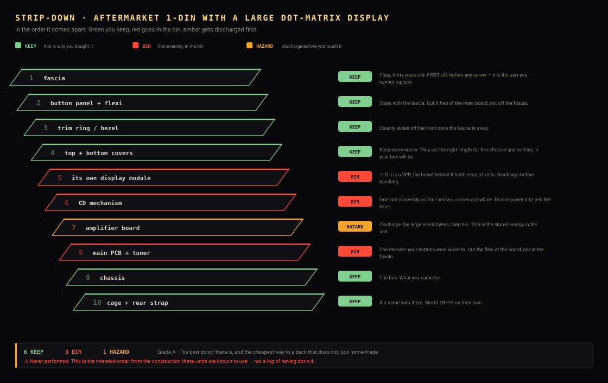

| | Part | | What happens to it |
|---|---|---|---|
| 1 | **fascia** | 🟩 **KEEP** | Clips, thirty years old. FIRST off, before any screw — it is the part you cannot replace. |
| 2 | **button panel + flexi** | 🟩 **KEEP** | Stays with the fascia. Cut it free of the main board, not off the fascia. |
| 3 | **trim ring / bezel** | 🟩 **KEEP** | Usually slides off the front once the fascia is away. |
| 4 | **top + bottom covers** | 🟩 **KEEP** | Keep every screw. They are the right length for this chassis and nothing in your box will be. |
| 5 | **its own display module** | 🟥 BIN | ⚠️ If it is a VFD, the board behind it holds tens of volts. Discharge before handling. |
| 6 | **CD mechanism** | 🟥 BIN | One sub-assembly on four screws, comes out whole. Do not power it to test the laser. |
| 7 | **amplifier board** | 🟧 **HAZARD** | Discharge the large electrolytics, then bin. This is the stored energy in the unit. |
| 8 | **main PCB + tuner** | 🟥 BIN | The decoder your buttons were wired to. Cut the flexi at the board, not at the fascia. |
| 9 | **chassis** | 🟩 **KEEP** | The box. What you came for. |
| 10 | **cage + rear strap** | 🟩 **KEEP** | If it came with them. Worth £8–15 on their own. |

**Why this one**

- The window is already a wide letterbox of roughly the right size, in roughly the right place, and usually already amber on black — which is exactly what the deck draws.
- They were made in enormous numbers and are worthless to everybody else once the CD mechanism jams, which is what makes them cheap.
- The fascia has enough buttons to fill the ladder without drilling.
- ⚠️ One caution that applies to the whole family: several of these have a native display of 128×32, which is HALF the deck's 256×64 across. The physical window is usually close to right because our panel has a finer pitch — but 'usually close' is not 'measured', and this is the family where a few millimetres decides it.

**⚠️ Watch out for**

- Motorised or flip-out fascias. The mechanism eats depth, it is fragile, and it is one more thing to defeat. Buy a fixed face.
- Models where the CD slot dominates the front — the window is small and high, and the deck's panel wants the middle.
- ⚠️ VFD models: the inverter board. Discharge it and bin it.

**How to gut it**

1. Take the fascia off FIRST, before any screws. Clips, not fasteners, and thirty years old. It is the part you cannot replace.
2. Unscrew the top and bottom covers and keep every screw — they are the right length for this chassis and nothing in your box will be.
3. Lift the whole internal assembly out before cutting anything, so you can see what holds what.
4. Bin the CD mechanism, the amplifier board and the main PCB. Discharge the large electrolytics first.
5. Keep the flexi from the button panel attached to the fascia and cut it free of the main board — you want the switches, not the matrix.
6. Lift the switch commons and wire each switch to its ladder resistor. Six buttons, six resistors, one wire to the deck.
7. Dry-fit the deck's panel behind the window before bonding anything, and check the lit area is centred in the aperture rather than in the fascia.

---

## A brand-new empty 1-DIN pocket

<a id="empty-pocket"></a>
**Grade A** — Buy this if you see one. · current, in stock

<sub>`donors/new/empty-pocket.json`</sub>

*For example: Universal single-DIN storage pocket / dash tray, 1-DIN blanking plate with trim bezel, Connects2 and similar universal fascia pockets.*

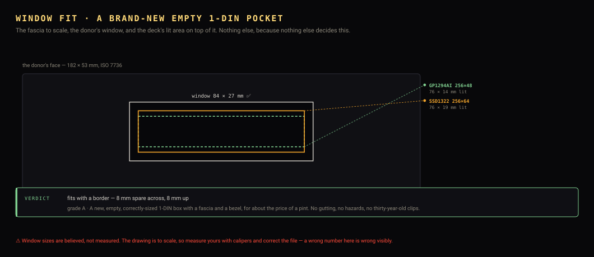

| | | |
|---|---|---|
| **What to pay** | ⚠️ £6–12 new | Sold as a 'single DIN storage pocket', 'dash tray' or 'blanking plate'. Their intended job is to fill the hole left by a removed radio, which means they are already exactly the right size. |
| **Window width** | ✅ 84 mm | You are cutting it into fresh ABS, so it is whatever you choose. 84 × 27 gives the 256×64 panel a 4 mm border. |
| **Window height** | ✅ 27 mm | As above. |
| **Chassis** | ⚠️ ABS plastic, 178 × 50 mm, DIN-standard | ⚠️ PLASTIC, not steel. Fine for a display-only deck that draws under 5 W, and it means no chassis ground — so plan the earthing deliberately rather than through the box. |
| **Cage** | ⚠️ no — buy an ISO 7736 cage | Some pockets are designed to slide into an existing cage; some are the cage. Check which you are buying. |
| **Buttons** | ✅ none — fit your own | Which is the advantage: six tactile switches where YOU want them, on the ladder values in BUILD.md, rather than where Pioneer put them in 1999. |
| **Knob** | ✅ none — fit a new EC11 and any knob you like |  |
| **Its own display** | ✅ none | ✅ Nothing to gut, nothing charged, no laser, no inverter. The only genuinely hazard-free entry in this document. |

### The front of it — the slot, the buttons, and the CD

| | | |
|---|---|---|
| **How the disc went in** | ✅ none — there was never a mechanism | Its intended job is to fill the hole a removed radio left. |
| **What it leaves behind** | ✅ none. You cut exactly the aperture you want, once | Fresh ABS, no history, no laser, no inverter, nothing charged. |
| **What to do with it** | ✅ cut 84 × 27 for the window and drill the buttons where your hand actually falls | The luxury of this route: the layout is yours rather than somebody else's from 1998. |
| **Can you keep the CD?** | ✅ — not applicable | There is none. |
| **Its buttons** | ✅ none — fit your own | Which means you can use proper tactile switches on a PCB and skip the flexi rewire entirely. For a first build this is the easiest front panel by a distance. |

<sub>Why the CD cannot be driven by the deck, what the hole is worth, and the one route that keeps a working CD player: [REUSE.md](REUSE.md).</sub>

### Specific units to search for

| | Model | Years | Its own display | Notes |
|---|---|---|---|---|
| ✅ | **Universal single-DIN storage pocket with trim bezel** | current | none — you cut the window | The commonest form. ABS, DIN-standard, a few pounds, everywhere. |
| ⚠️ | **1-DIN blanking plate / dash tray** | current | none | Shallower than a pocket. ⚠️ Check the depth before buying — some are trays a few centimetres deep and will not hold the boards. |
| ✅ | **Connects2 and similar universal fascia plates** | current | none | Sold for filling gaps around aftermarket radios; some are full pockets. Better made than the generic ones and priced accordingly. |

<sub>✅ buy it · ⚠️ workable, read the note · ❌ avoid for this build. Model names are ⚠️ researched, not handled.</sub>

### Keeping more of it

The strip-down above is the *simple* build. If you would rather keep as much as possible — and one of these is a part [BUILD.md](BUILD.md) otherwise tells you to buy — see [REUSE.md](REUSE.md).

| Part | Worth keeping for | Difficulty | |
|---|---|---|---|
| **nothing — there is nothing in it** | none | not worth it | ✅ This route has no donor to salvage from, which is the point. Everything is new and everything is bought. If maximum reuse is what you want, this is the wrong family — see the cassette-era entry. |

### Stripping it down

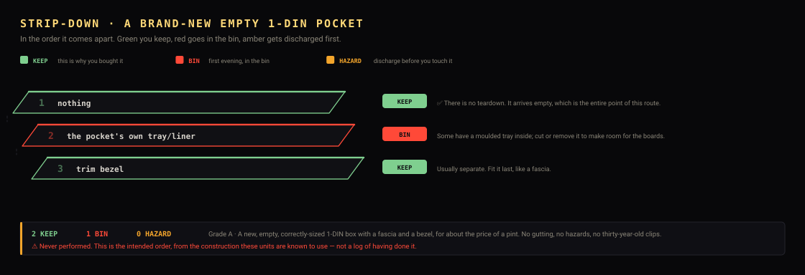

| | Part | | What happens to it |
|---|---|---|---|
| 1 | **nothing** | 🟩 **KEEP** | ✅ There is no teardown. It arrives empty, which is the entire point of this route. |
| 2 | **the pocket's own tray/liner** | 🟥 BIN | Some have a moulded tray inside; cut or remove it to make room for the boards. |
| 3 | **trim bezel** | 🟩 **KEEP** | Usually separate. Fit it last, like a fascia. |

**Why this one**

- It is already the right size, already has a fascia and a trim bezel, and is in stock everywhere for under £12 — which is less than most spares-or-repair head units.
- Fresh ABS cuts and files far more cleanly than thirty-year-old painted plastic, so the window ends up exactly where you want it and looks deliberate.
- No CD laser, no VFD inverter, no charged electrolytics, no clips that snap. It is the safest and fastest route to a fitted deck.
- You choose the button layout instead of inheriting one.

**⚠️ Watch out for**

- ⚠️ It is PLASTIC. No chassis ground, and less stiff than steel — support the boards properly rather than letting the panel hang off the face.
- ⚠️ Check whether the pocket includes a cage or expects to slide into one. The listings are not consistent and the photographs rarely settle it.
- It looks like an aftermarket blanking plate, because that is what it is. If you want the deck to look factory, this is the wrong route — see the OEM entry.
- Depth varies a lot between pockets, and some are very shallow trays rather than boxes. Read the dimensions, not the picture.

**How to gut it**

1. Buy the pocket and a separate ISO 7736 cage unless the pocket is one.
2. Mark the window from the PANEL's active area, not from a measurement, and not from the module's PCB outline — the lit area is usually not centred on the board.
3. Drill the corners, cut inside the line with a fine blade, file to the line. ABS cuts cleanly and melts if you rush it.
4. Back the window with 1 mm smoked acrylic bonded from behind.
5. Drill for six tactile switches and the encoder wherever suits your hand, then wire the ladder — the resistor values are in BUILD.md.
6. ⚠️ Run a proper ground wire to the car's earth. A plastic box gives you no chassis return, and this is the one thing a steel donor did for free.

---

## Cassette-era 1-DIN

<a id="cassette-era"></a>
**Grade B** — Good, with one thing to think about first. · ≈1985–1998

<sub>`donors/aftermarket/cassette-era.json`</sub>

*For example: 1980s–90s Pioneer / Sony / Blaupunkt / Clarion cassette decks, OEM cassette units from the same era.*

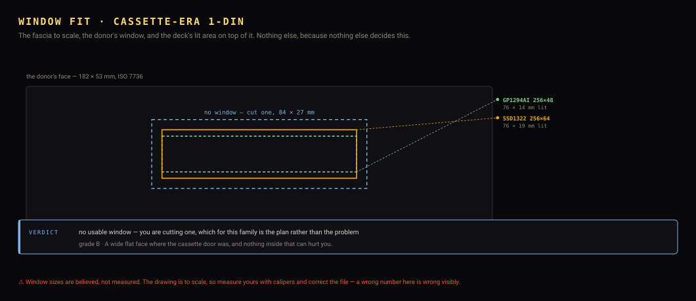

| | | |
|---|---|---|
| **What to pay** | ⚠️ £5–15, often free from a scrapyard | Nobody wants these at all, which is the point. |
| **Window width** | 📏 — | There is usually no display window worth using — the space is the cassette door. That is an OPPORTUNITY: a flat rectangular hole you can cut cleanly, rather than a small one you must enlarge. |
| **Window height** | 📏 — | As above. |
| **Chassis** | ⚠️ steel, deep, heavy | Built like furniture. Also the deepest chassis here, which is the wrong direction if your car is tight. |
| **Cage** | ⚠️ sometimes; older units were often screwed in directly | ⚠️ Pre-ISO mounting is common on this era. Budget for a new cage. |
| **Buttons** | ⚠️ mechanical, large, satisfying, and often not on a flexi | Discrete switches are EASIER to convert to a ladder than a matrix, not harder. |
| **Knob** | ⚠️ often twin concentric knobs — volume and tone | The best-feeling knobs of any donor here, by a wide margin. |
| **Its own display** | ⚠️ none, or a small backlit dial | Nothing to discharge. The safest possible teardown. |

### The front of it — the slot, the buttons, and the CD

| | | |
|---|---|---|
| **How the disc went in** | ⚠️ a hinged, spring-loaded cassette door across most of the face | The door IS the front. It is a flat rectangle roughly 100 × 15 mm with a proper hinge and a return spring. |
| **What it leaves behind** | ⚠️ none, if you keep the door — it closes flush and looks factory | This is the only family where the aperture problem solves itself. Every other donor leaves you a hole to fill. |
| **What to do with it** | ⚠️ ✅ EITHER keep the door shut and cut your window elsewhere, OR remove the door and use its aperture as the window | The cassette aperture is the best window in the project: wide, flat, square-cornered, and already the full width of the face. You are enlarging nothing — you are filing a hole DOWN to size, which is far easier than opening one up. |
| **Can you keep the CD?** | ✅ ❌ no, and you would not want to | A tape deck needs its own head amplifier, motor control and logic — all on the board you are removing. And it is a cassette deck. |
| **Its buttons** | ⚠️ ✅ THE BEST BUTTONS OF ANY FAMILY — large, mechanical, and often on a proper PCB rather than a carbon flexi | Period buttons have travel and a click that nothing you can buy for 20p reproduces. On a PCB they are also the easy case to rewire: cut the traces, common one side, resistor on the other. |

<sub>Why the CD cannot be driven by the deck, what the hole is worth, and the one route that keeps a working CD player: [REUSE.md](REUSE.md).</sub>

### Specific units to search for

| | Model | Years | Its own display | Notes |
|---|---|---|---|---|
| ✅ | **Blaupunkt Bremen SQR 46** | 1986 onward | small dial; the cassette door is the space you want | The cult classic, reissued in 2019 as the Bremen SQR 46 DAB. The original is period-correct and the fascia is beautiful. ⚠️ Price reflects the cult status — you may pay more than for a grade-A donor. |
| ✅ | **Blaupunkt Woodstock / London / Toronto (1990s)** | ≈1990–1998 | small backlit dial | The city-named Blaupunkts are everywhere in the UK and EU and nobody wants them. Steel, deep, and the cassette aperture is a clean rectangle. |
| ✅ | **Pioneer KEH- series** | ≈1988–1997 | small dial | Pioneer's cassette line. Plentiful, cheap, and built well. |
| ✅ | **Sony XR- series** | ≈1990–1998 | small dial | The same story as the Pioneer. Often free with a scrapyard dash. |
| ⚠️ | **Becker Mexico / Grand Prix** | ≈1985–1998 | small dial | ⚠️ The nicest cassette fascias made, and priced like it — these are sought after for period-correct restorations. Buy one only if you want that specific look and can justify the cost. |
| ✅ | **Any OEM cassette head unit from a scrapyard** | ≈1985–1998 | varies | ✅ Free or near enough. Nothing inside can hurt you, and the cassette door leaves a clean rectangular hole to work with. |

<sub>✅ buy it · ⚠️ workable, read the note · ❌ avoid for this build. Model names are ⚠️ researched, not handled.</sub>

### Keeping more of it

The strip-down above is the *simple* build. If you would rather keep as much as possible — and one of these is a part [BUILD.md](BUILD.md) otherwise tells you to buy — see [REUSE.md](REUSE.md).

| Part | Worth keeping for | Difficulty | |
|---|---|---|---|
| **the donor's own amplifier** | £12–20, and it is the easiest amp to reuse of any donor here | easy | ✅ The best case in this document. Cassette-era amplifiers are discrete or single-IC, generously laid out, and their inputs are easy to find because there is no digital preamp in the way — the tape head fed them almost directly. If you want maximum reuse, this is the family to choose. |
| **the rear ISO connectors and aerial socket** | £8–15 of adapters, and a tidier back panel | easy | The donor's own ISO 10487 A and B blocks and its DIN aerial socket are already mounted in the back panel and already the standard shape. Keeping them means the deck plugs into the car's loom with no adapter and no flying leads out of a hole. |
| **the heatsink** | hard to buy in the right shape | easy | On most units the amplifier's heatsink IS part of the chassis casting. If you reuse the amp you get it for nothing; if you fit your own amp board, bolting it to the same casting is free cooling. |
| **the 12 V input protection** | a pound, and some peace of mind | easy | The reverse-polarity diode, the input fuse holder and the filter capacitors on the donor's power input are already rated for a car's supply. Cheap to buy, but they are already there and already fused. |
| **the illumination bulbs and light pipes** | the period look | easy | Filament bulbs behind the dial. Replace the bulbs with amber LEDs and keep the pipes — the diffusers are the hard part and you already have them. |
| **its own display** | none | not worth it | ❌ A backlit dial, not a display. Nothing to drive. |

### Stripping it down

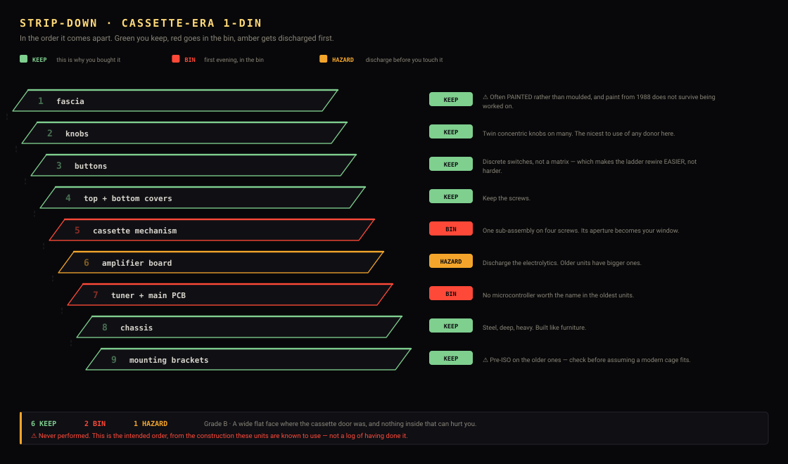

| | Part | | What happens to it |
|---|---|---|---|
| 1 | **fascia** | 🟩 **KEEP** | ⚠️ Often PAINTED rather than moulded, and paint from 1988 does not survive being worked on. |
| 2 | **knobs** | 🟩 **KEEP** | Twin concentric knobs on many. The nicest to use of any donor here. |
| 3 | **buttons** | 🟩 **KEEP** | Discrete switches, not a matrix — which makes the ladder rewire EASIER, not harder. |
| 4 | **top + bottom covers** | 🟩 **KEEP** | Keep the screws. |
| 5 | **cassette mechanism** | 🟥 BIN | One sub-assembly on four screws. Its aperture becomes your window. |
| 6 | **amplifier board** | 🟧 **HAZARD** | Discharge the electrolytics. Older units have bigger ones. |
| 7 | **tuner + main PCB** | 🟥 BIN | No microcontroller worth the name in the oldest units. |
| 8 | **chassis** | 🟩 **KEEP** | Steel, deep, heavy. Built like furniture. |
| 9 | **mounting brackets** | 🟩 **KEEP** | ⚠️ Pre-ISO on the older ones — check before assuming a modern cage fits. |

**Why this one**

- The cassette aperture is a big, clean, rectangular hole in the middle of the face — which is exactly the shape the deck's panel wants, and you are cutting an existing opening rather than making one.
- No laser, no inverter, nothing charged. The safest category.
- The knobs and buttons are the nicest to use, and period-correct for the aesthetic this whole project is chasing.

**⚠️ Watch out for**

- Depth. These are the deepest chassis in this document.
- ⚠️ Pre-ISO mounting on the older ones — the cage may not be a cage. Check before assuming it drops into a modern aperture.
- The fascia is often painted rather than moulded, and paint from 1988 does not survive being worked on.

**How to gut it**

1. Fascia first, as always.
2. Remove the cassette mechanism — it is usually one sub-assembly on four screws and comes out whole.
3. The cassette aperture becomes the window. Back it with 1 mm smoked acrylic bonded from behind and it looks like it was always a display.
4. Convert the discrete switches to the ladder directly — no flexi to lift, just a wire per switch and a common return.
5. ⚠️ Check the mounting before you build the chassis: if it is pre-ISO you need a modern cage and the donor's own brackets are no use.

---

## No donor — build the chassis yourself

<a id="fold-your-own"></a>
**Grade B** — Good, with one thing to think about first. · n/a

<sub>`donors/none/fold-your-own.json`</sub>

*For example: 1 mm aluminium sheet, 3 mm acrylic for the face, A new ISO 7736 cage.*

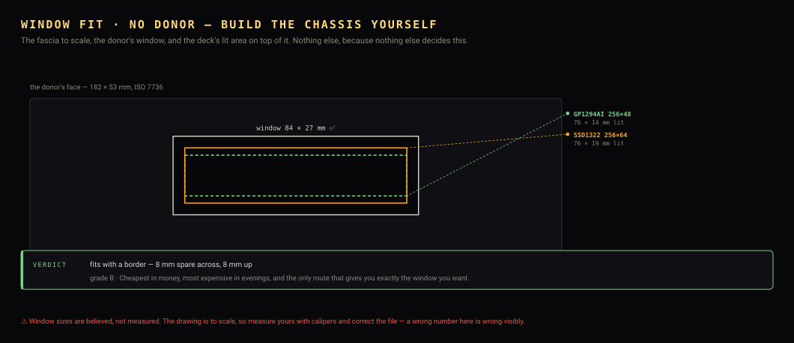

| | | |
|---|---|---|
| **What to pay** | ⚠️ £12–20 in materials plus £8–15 for a cage | Cheaper than a good donor, if you do not count your time. |
| **Window width** | ✅ 84 mm | You are cutting it, so it is whatever you choose. 84 × 27 gives the 256×64 panel a 4 mm border on every side. |
| **Window height** | ✅ 27 mm | As above. |
| **Chassis** | ✅ 1 mm aluminium, folded | Fold to 178 mm wide so the cage's own thickness brings it to 182. Depth is yours to choose, which is the advantage. |
| **Cage** | ✅ no — buy one | A new ISO 7736 cage is £8–15 and is the one part not worth fabricating. |
| **Buttons** | ✅ new tactile switches, exactly where you want them | Six on a ladder, laid out by you rather than by Pioneer in 1999. |
| **Knob** | ✅ a new EC11 encoder and any knob you like |  |
| **Its own display** | ✅ n/a | Nothing to gut and nothing to discharge. |

### The front of it — the slot, the buttons, and the CD

| | | |
|---|---|---|
| **How the disc went in** | ✅ — not applicable | There is no donor. |
| **What it leaves behind** | ✅ — not applicable | You are bending the box, so every aperture is deliberate. |
| **What to do with it** | ✅ mark the window from the lit glass, not from the module outline | The one rule that survives from every other route. See TRANSPLANT.md. |
| **Can you keep the CD?** | ✅ — not applicable | There is none. |
| **Its buttons** | ✅ new tactile switches, exactly where you want them | See the empty-pocket route: this is the easy case. |

<sub>Why the CD cannot be driven by the deck, what the hole is worth, and the one route that keeps a working CD player: [REUSE.md](REUSE.md).</sub>

**Why this one**

- The window is exactly right, because you cut it to the panel.
- The depth is exactly right for your car, because you fold it to fit — which is the one thing no donor can offer.
- Nothing to strip, nothing charged, no laser, no thirty-year-old clips to break.

**⚠️ Watch out for**

- It is real metalwork. A bench vice, a folding bar or a sheet of steel and a mallet, and a straight edge you trust.
- A hand-cut window in aluminium looks hand-cut. Acrylic is far more forgiving and is what the face should be.
- ⚠️ Deburr everything. A folded 1 mm edge inside a dashboard is sharp, and you will be reaching past it with a loom in one hand.

**How to gut it**

1. Fold the chassis 178 mm wide — the cage takes the remaining 2 mm a side.
2. Choose the depth from YOUR car's measurement, not from this project's ~160 mm. This is the whole advantage of the route.
3. Cut the face from 3 mm acrylic, window 84 × 27 for a 256×64 panel.
4. Back the window with 1 mm smoked acrylic bonded from behind.
5. Fit new tactile switches and an EC11 to the ladder values in BUILD.md.
6. Buy the cage. Do not fabricate it — its spring tabs are the one part that has to be right and is cheap to buy.

---

## A 2-DIN unit, split down to 1-DIN plus a pocket

<a id="two-din-split"></a>
**Grade B** — Good, with one thing to think about first. · ≈2000–present

<sub>`donors/aftermarket/two-din-split.json`</sub>

*For example: Any double-DIN CD/DVD receiver, spares-or-repair, 2-DIN cage + trim ring bought separately, 1-DIN + pocket fascia kits.*

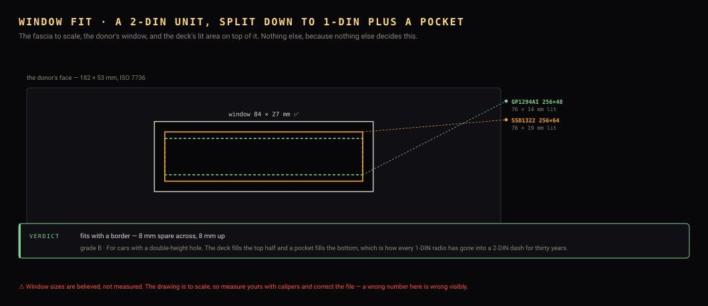

| | | |
|---|---|---|
| **What to pay** | ⚠️ £10–25 spares-or-repair, or £12–20 for a cage and pocket new | Broken 2-DIN units are cheap because a cracked touchscreen makes them worthless — and you were binning the screen anyway. |
| **Window width** | ✅ 84 mm | You are building the top half yourself, so the window is whatever you cut. The donor supplies the cage and the surround, not the face. |
| **Window height** | ✅ 27 mm | As above. |
| **Chassis** | ⚠️ steel, 2-DIN cage; you build a 1-DIN box inside it | The useful part is the CAGE and the trim ring, which are car-aperture-sized and hard to fabricate. |
| **Cage** | ⚠️ yes, and it is the reason to buy one | A 2-DIN cage plus a 1-DIN-and-pocket adapter is the whole point of this route. |
| **Buttons** | 📏 whatever the donor had, often on a touchscreen instead | ⚠️ A touchscreen unit may have almost NO physical buttons. Count before relying on the fascia for six. |
| **Knob** | 📏 often a single encoder, sometimes none | Touchscreen-era units frequently have no knob at all, which is a poor start for a deck built around one. |
| **Its own display** | ⚠️ TFT or touchscreen | ⚠️ A backlit TFT has an inverter on the older ones. LED backlights do not. Check before probing. |

### The front of it — the slot, the buttons, and the CD

| | | |
|---|---|---|
| **How the disc went in** | ⚠️ varies — but on this route you may not be removing it at all | See `keep_the_mechanism`. This is the one family where the question 'can I keep the CD?' has a yes in it. |
| **What it leaves behind** | ✅ none — you are building the 1-DIN face yourself | The donor supplies the cage and the surround, not the face. |
| **What to do with it** | ⚠️ the bottom half is the answer: amplifier, or the whole original unit left working | A 2-DIN aperture is two problems solved at once — where the amplifier goes, and what to do about the CD. |
| **Can you keep the CD?** | ⚠️ ✅ YES — the only route in this project where you can. Do not split it: leave the donor whole in the bottom half and put the deck above it | The old unit keeps doing what it is good at — CD, radio, volume, tone, and 4 × 45 W of amplifier — and the deck feeds its AUX input and does Bluetooth and the display. Nothing is gutted, nothing is soldered, and you keep a working CD player. ⚠️ It needs a 2-DIN aperture and a donor WITH an aux input: front 3.5 mm on most units after ~2005, rear RCA on better ones. Pre-2005 units mostly have neither. See REUSE.md. |
| **Its buttons** | ⚠️ whatever the donor had — often a touchscreen instead, which is no use to you | Buy the buttons separately, or take them from a second, cheaper donor. A dead 2-DIN and a dead cassette unit together are still under £30. |

<sub>Why the CD cannot be driven by the deck, what the hole is worth, and the one route that keeps a working CD player: [REUSE.md](REUSE.md).</sub>

### Specific units to search for

| | Model | Years | Its own display | Notes |
|---|---|---|---|---|
| ✅ | **Any 2-DIN CD/DVD receiver with a cracked screen** | ≈2005–2018 | TFT, usually broken | The cheapest source of a 2-DIN cage there is. The fault that makes it worthless is in the part you are removing. |
| ✅ | **Pioneer AVH- series** | ≈2006–present | TFT touchscreen | Common, and the cages and trim rings are well made. |
| ✅ | **Kenwood DDX / DNX series** | ≈2006–present | TFT touchscreen | As above. DNX are navigation units and go cheaper still once the maps are obsolete. |
| ✅ | **Sony XAV- series** | ≈2008–present | TFT touchscreen | Widely available broken. |
| ✅ | **A 2-DIN cage and 1-DIN+pocket fascia, bought new** | current | none | ✅ Skip the donor entirely. Under £20 for both, no teardown, no hazards — the same logic as the empty-pocket route one size up. |

<sub>✅ buy it · ⚠️ workable, read the note · ❌ avoid for this build. Model names are ⚠️ researched, not handled.</sub>

### Keeping more of it

The strip-down above is the *simple* build. If you would rather keep as much as possible — and one of these is a part [BUILD.md](BUILD.md) otherwise tells you to buy — see [REUSE.md](REUSE.md).

| Part | Worth keeping for | Difficulty | |
|---|---|---|---|
| **the donor's own amplifier** | £12–20 and a part you would otherwise buy | medium | ⚠️ THE BIG ONE. Every CD-era head unit contains a 4-channel amplifier — usually a TDA7388, TDA7850 or similar — already bolted to the chassis as its heatsink and already wired to the ISO speaker connector. That is exactly the part BUILD.md tells you to go and buy. Cut the amp IC's four inputs free of the dead preamp and inject the deck's line out there instead. The IC datasheet gives the pinout; the mute/standby pin usually needs tying to its enable level, and that is the step people miss. |
| **the rear ISO connectors and aerial socket** | £8–15 of adapters, and a tidier back panel | easy | The donor's own ISO 10487 A and B blocks and its DIN aerial socket are already mounted in the back panel and already the standard shape. Keeping them means the deck plugs into the car's loom with no adapter and no flying leads out of a hole. |
| **the heatsink and chassis** | none — you are not keeping this box | not worth it | ⚠️ Remember this is the one route where the donor's chassis is the wrong height and gets binned. Salvage the amp and the connectors OUT of it before it goes. |
| **the 12 V input protection** | a pound, and some peace of mind | easy | The reverse-polarity diode, the input fuse holder and the filter capacitors on the donor's power input are already rated for a car's supply. Cheap to buy, but they are already there and already fused. |

### Stripping it down

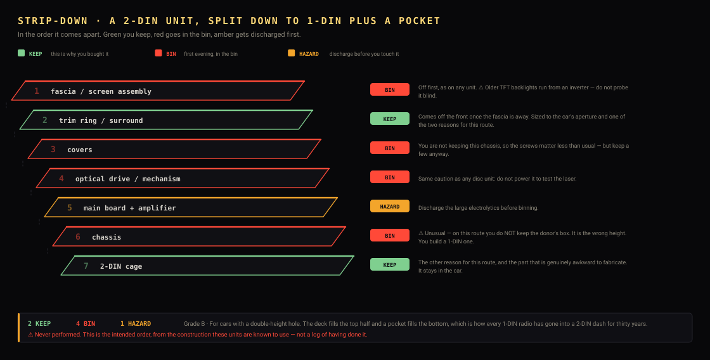

| | Part | | What happens to it |
|---|---|---|---|
| 1 | **fascia / screen assembly** | 🟥 BIN | Off first, as on any unit. ⚠️ Older TFT backlights run from an inverter — do not probe it blind. |
| 2 | **trim ring / surround** | 🟩 **KEEP** | Comes off the front once the fascia is away. Sized to the car's aperture and one of the two reasons for this route. |
| 3 | **covers** | 🟥 BIN | You are not keeping this chassis, so the screws matter less than usual — but keep a few anyway. |
| 4 | **optical drive / mechanism** | 🟥 BIN | Same caution as any disc unit: do not power it to test the laser. |
| 5 | **main board + amplifier** | 🟧 **HAZARD** | Discharge the large electrolytics before binning. |
| 6 | **chassis** | 🟥 BIN | ⚠️ Unusual — on this route you do NOT keep the donor's box. It is the wrong height. You build a 1-DIN one. |
| 7 | **2-DIN cage** | 🟩 **KEEP** | The other reason for this route, and the part that is genuinely awkward to fabricate. It stays in the car. |

**Why this one**

- It is the only sensible answer for a car with a 2-DIN aperture, and two cars in this project's vehicle list have one.
- Cracked-screen 2-DIN units are worth nothing to anybody, and the screen is the part you were throwing away.
- You get a 2-DIN cage and trim ring, which are the parts that are genuinely awkward to make and are sized to the car's hole.
- The bottom half becomes real storage, which every owner of a small car wants anyway.

**⚠️ Watch out for**

- ⚠️ You are building the 1-DIN box yourself — this route gives you the cage and the surround, not a ready-made chassis. Combine it with the fold-your-own or empty-pocket entries.
- ⚠️ Touchscreen units often have no usable buttons and no knob. Establish what physical controls exist before buying.
- The 1-DIN half must sit at the TOP of the aperture, not the bottom, or the display ends up below the driver's sight line.
- Older TFT backlights use an inverter. Not as lively as a VFD supply, still not something to probe blind.

**How to gut it**

1. Confirm your car's aperture is actually 2-DIN — VEHICLES.md, then measure.
2. Buy the broken 2-DIN unit for its cage and trim ring, or buy those new.
3. Strip it: the screen, the mechanism and all the boards go.
4. Build or buy the 1-DIN box for the top half — see the fold-your-own and empty-pocket entries, which are the same job from here on.
5. Fit a 1-DIN storage pocket in the bottom half so the result looks intentional rather than gap-toothed.
6. ⚠️ Mount the deck in the TOP half. A display below the centre console's midline is one you have to look down at.

---

## Your own car's factory unit — the sleeper build

<a id="your-own-car"></a>
**Grade B** — Good, with one thing to think about first. · whatever your car is

<sub>`donors/oem/your-own-car.json`</sub>

*For example: The head unit currently in your dashboard, A second-hand one for your exact model, so you keep the original.*

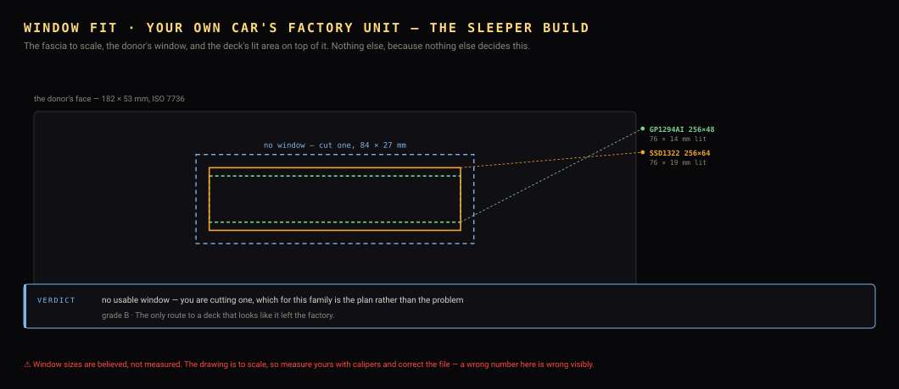

| | | |
|---|---|---|
| **What to pay** | ⚠️ £15–60 for a used unit for your model | ⚠️ Buy a SECOND one rather than gutting the one in your car. If the build stalls you still have a working radio, and if you sell the car you can put it back. |
| **Window width** | 📏 — | OEM windows are usually SMALL — a segment display for frequency and track number. Measure before committing to this route. |
| **Window height** | 📏 — | As above. |
| **Chassis** | 📏 varies entirely by manufacturer | Some are a standard 1-DIN box in a car-specific surround; some are car-specific throughout. Yours decides how much of this project applies. |
| **Cage** | ⚠️ usually not — OEM units bolt to car-specific brackets | This is the big structural difference from an aftermarket donor and it is easy to overlook. |
| **Buttons** | 📏 varies; often fewer than an aftermarket unit | Count them before choosing this route — you want six. |
| **Knob** | ⚠️ usually one, car-styled | The reason to do this at all: it matches the rest of the interior. |
| **Its own display** | 📏 varies | ⚠️ Many OEM units of the right era use a VFD. Treat the power board as live. |

### The front of it — the slot, the buttons, and the CD

| | | |
|---|---|---|
| **How the disc went in** | 📏 varies — a slot on the face, or a flip-down, or a cassette door | OEM units are all over the place. Photograph yours before you start. |
| **What it leaves behind** | 📏 ⚠️ usually yes, and usually a slot | Factory units tend to be fixed-face with the slot on show. |
| **What to do with it** | ⚠️ the same trick as the segment-LCD family: file the slot down to 27 mm and make it the window | OEM display windows are usually tiny — a frequency and a track number — so the slot is very often the only aperture big enough to be worth having. |
| **Can you keep the CD?** | ⚠️ ❌ no, with one exception | The exception is the two-box route: if your car has a 2-DIN aperture, leave the factory unit whole in the bottom half and put the deck above it. You keep the CD, the factory amplifier and the factory connector, and you gut nothing. See REUSE.md. |
| **Its buttons** | 📏 varies, and often fewer than an aftermarket unit | Count them before committing. ⚠️ Some OEM units put half their controls on the steering wheel or a stalk, and those do not come with the head unit. |

<sub>Why the CD cannot be driven by the deck, what the hole is worth, and the one route that keeps a working CD player: [REUSE.md](REUSE.md).</sub>

### Keeping more of it

The strip-down above is the *simple* build. If you would rather keep as much as possible — and one of these is a part [BUILD.md](BUILD.md) otherwise tells you to buy — see [REUSE.md](REUSE.md).

| Part | Worth keeping for | Difficulty | |
|---|---|---|---|
| **the donor's own amplifier** | £12–20 and a part you would otherwise buy | medium | ⚠️ THE BIG ONE. Every CD-era head unit contains a 4-channel amplifier — usually a TDA7388, TDA7850 or similar — already bolted to the chassis as its heatsink and already wired to the ISO speaker connector. That is exactly the part BUILD.md tells you to go and buy. Cut the amp IC's four inputs free of the dead preamp and inject the deck's line out there instead. The IC datasheet gives the pinout; the mute/standby pin usually needs tying to its enable level, and that is the step people miss. |
| **the heatsink** | hard to buy in the right shape | easy | On most units the amplifier's heatsink IS part of the chassis casting. If you reuse the amp you get it for nothing; if you fit your own amp board, bolting it to the same casting is free cooling. |
| **the 12 V input protection** | a pound, and some peace of mind | easy | The reverse-polarity diode, the input fuse holder and the filter capacitors on the donor's power input are already rated for a car's supply. Cheap to buy, but they are already there and already fused. |
| **the car-specific connector** | an adapter you would otherwise buy | easy | ✅ Better than an ISO block: the donor already has YOUR car's exact connector on it, so keeping the back panel means no harness adapter at all. This is a real advantage of the OEM route that the fascia usually gets all the credit for. |
| **its own display** | the factory look, completely | hard | ⚠️ Same problem as any donor and usually worse — OEM displays are small, segment-based and custom. Measure and identify before hoping. |

### Stripping it down

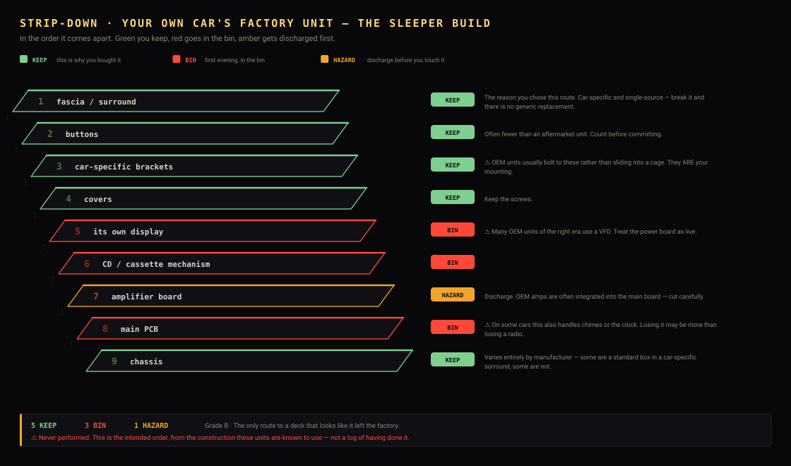

| | Part | | What happens to it |
|---|---|---|---|
| 1 | **fascia / surround** | 🟩 **KEEP** | The reason you chose this route. Car-specific and single-source — break it and there is no generic replacement. |
| 2 | **buttons** | 🟩 **KEEP** | Often fewer than an aftermarket unit. Count before committing. |
| 3 | **car-specific brackets** | 🟩 **KEEP** | ⚠️ OEM units usually bolt to these rather than sliding into a cage. They ARE your mounting. |
| 4 | **covers** | 🟩 **KEEP** | Keep the screws. |
| 5 | **its own display** | 🟥 BIN | ⚠️ Many OEM units of the right era use a VFD. Treat the power board as live. |
| 6 | **CD / cassette mechanism** | 🟥 BIN |  |
| 7 | **amplifier board** | 🟧 **HAZARD** | Discharge. OEM amps are often integrated into the main board — cut carefully. |
| 8 | **main PCB** | 🟥 BIN | ⚠️ On some cars this also handles chimes or the clock. Losing it may be more than losing a radio. |
| 9 | **chassis** | 🟩 **KEEP** | Varies entirely by manufacturer — some are a standard box in a car-specific surround, some are not. |

**Why this one**

- The fascia already fits your dashboard exactly, because it was made for it. No adapter, no gap, no aftermarket look.
- The knobs, the button shapes and the texture match the rest of the interior, which nothing bought will.
- It is the only route where somebody looking at the dash does not immediately see that something has been changed.

**⚠️ Watch out for**

- ⚠️ The window is usually far too small, and enlarging an OEM fascia destroys the exact thing you chose it for. Measure FIRST — this route is only worth it if the window is usable or the fascia can take a clean new aperture.
- OEM units often have no cage, bolting to car-specific brackets instead. You may keep the brackets and lose the cage.
- Car-specific means single-source: if you break the fascia, there is no generic replacement.
- ⚠️ Do not gut the unit currently in your car. Buy a second.

**How to gut it**

1. Check your car's entry in docs/VEHICLES.md first — it tells you what the aperture and harness are before you buy anything.
2. Buy a second-hand unit for your exact model rather than removing yours.
3. Measure the window before any disassembly. If it will not take 76 × 19 mm, decide now whether you are cutting it or choosing a different route.
4. Note how it mounts — brackets or cage — because that decides the chassis you build.
5. Then the standard teardown: fascia first, keep every screw.

---

## A modern retro-styled reissue

<a id="retro-reissue"></a>
**Grade C** — Usable. You will be cutting the fascia. · current

<sub>`donors/new/retro-reissue.json`</sub>

*For example: Blaupunkt Bremen SQR 46 DAB, RetroSound and similar, Other 'classic look, modern internals' 1-DIN units.*

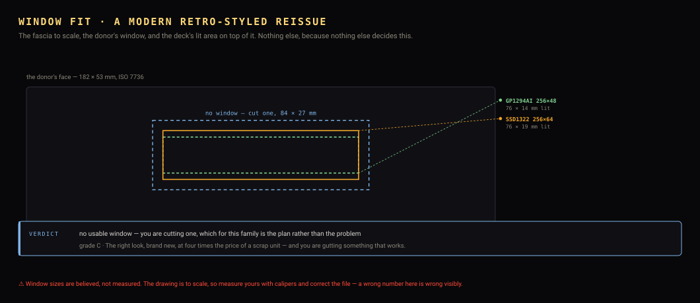

| | | |
|---|---|---|
| **What to pay** | ⚠️ £150–400 new | ⚠️ By far the most expensive entry here, and the only one where you destroy a working product to do it. |
| **Window width** | 📏 — | Reissues generally have a small modern display in a period-looking face. Measure before assuming. |
| **Window height** | 📏 — | As above. |
| **Chassis** | ⚠️ steel, modern, DIN-standard | Well made, as you would expect at the price. |
| **Cage** | ⚠️ yes | New units ship with one. |
| **Buttons** | ⚠️ period-styled, good quality | The reason somebody would consider this at all. |
| **Knob** | ⚠️ period-styled, often twin concentric | Genuinely lovely, and the best-matched knobs to the aesthetic this project is chasing. |
| **Its own display** | ⚠️ modern LCD or OLED | No inverter, nothing charged. Safe to open. |

### The front of it — the slot, the buttons, and the CD

| | | |
|---|---|---|
| **How the disc went in** | ⚠️ ⚠️ usually none — most reissues are 'mechless', Bluetooth and USB only | The period look without the period mechanism. Check the listing: some carry a cassette door as pure decoration, which is ideal. |
| **What it leaves behind** | ⚠️ usually none, and where there is a fake door it closes | A decorative door is the best of both — nothing to fill, and it looks like the deck plays tapes. |
| **What to do with it** | ⚠️ keep the face exactly as it is and cut the window behind the existing display aperture | You are paying for the styling, so do not cut through it. |
| **Can you keep the CD?** | ⚠️ — usually nothing to keep | Mechless by design. |
| **Its buttons** | ⚠️ period-styled and good quality — worth keeping for the look alone | New, so the flexi is not thirty years old and brittle. |

<sub>Why the CD cannot be driven by the deck, what the hole is worth, and the one route that keeps a working CD player: [REUSE.md](REUSE.md).</sub>

### Specific units to search for

| | Model | Years | Its own display | Notes |
|---|---|---|---|---|
| ⚠️ | **Blaupunkt Bremen SQR 46 DAB** | 2019–present | modern display in the 1986 face | The reissue of the cult classic, with Bluetooth, DAB and USB built in. ⚠️ Consider buying it and stopping — it may already be the thing you wanted. |
| ⚠️ | **RetroSound Model One / Two and similar** | current | small modern display | American, aimed at classic-car restorations, with swappable knobs and faces. ⚠️ Small window in a large face. |
| ⚠️ | **Other 'retro' 1-DIN Bluetooth receivers** | current | varies | A crowded and inconsistent market. Measure the window from the listing photographs before ordering. |

<sub>✅ buy it · ⚠️ workable, read the note · ❌ avoid for this build. Model names are ⚠️ researched, not handled.</sub>

### Keeping more of it

The strip-down above is the *simple* build. If you would rather keep as much as possible — and one of these is a part [BUILD.md](BUILD.md) otherwise tells you to buy — see [REUSE.md](REUSE.md).

| Part | Worth keeping for | Difficulty | |
|---|---|---|---|
| **the whole unit, working** | £150–400 — by not gutting it | easy | ⚠️ The honest first answer for this family. A modern reissue already does Bluetooth, DAB and USB. Ask whether you want the deck's screens or whether you wanted a nice-looking radio, because if it is the second one you have already bought it. |
| **the donor's own amplifier** | £12–20 and a part you would otherwise buy | medium | ⚠️ THE BIG ONE. Every CD-era head unit contains a 4-channel amplifier — usually a TDA7388, TDA7850 or similar — already bolted to the chassis as its heatsink and already wired to the ISO speaker connector. That is exactly the part BUILD.md tells you to go and buy. Cut the amp IC's four inputs free of the dead preamp and inject the deck's line out there instead. The IC datasheet gives the pinout; the mute/standby pin usually needs tying to its enable level, and that is the step people miss. |
| **the rear ISO connectors and aerial socket** | £8–15 of adapters, and a tidier back panel | easy | The donor's own ISO 10487 A and B blocks and its DIN aerial socket are already mounted in the back panel and already the standard shape. Keeping them means the deck plugs into the car's loom with no adapter and no flying leads out of a hole. |
| **the 12 V input protection** | a pound, and some peace of mind | easy | The reverse-polarity diode, the input fuse holder and the filter capacitors on the donor's power input are already rated for a car's supply. Cheap to buy, but they are already there and already fused. |

### Stripping it down

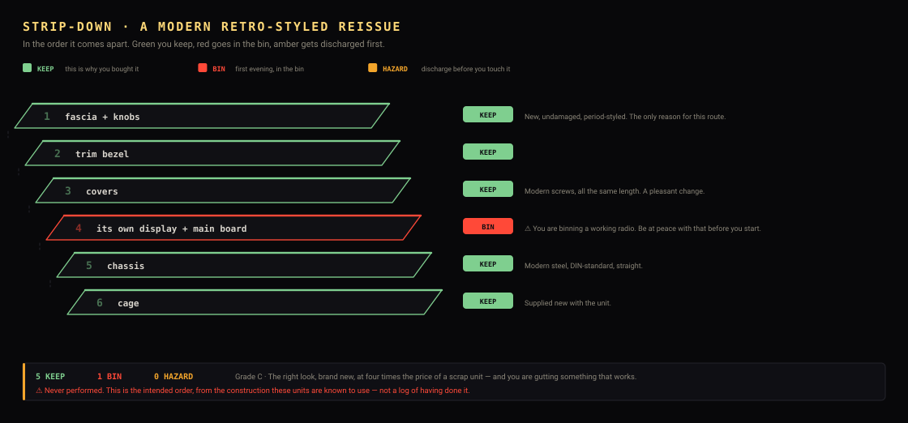

| | Part | | What happens to it |
|---|---|---|---|
| 1 | **fascia + knobs** | 🟩 **KEEP** | New, undamaged, period-styled. The only reason for this route. |
| 2 | **trim bezel** | 🟩 **KEEP** |  |
| 3 | **covers** | 🟩 **KEEP** | Modern screws, all the same length. A pleasant change. |
| 4 | **its own display + main board** | 🟥 BIN | ⚠️ You are binning a working radio. Be at peace with that before you start. |
| 5 | **chassis** | 🟩 **KEEP** | Modern steel, DIN-standard, straight. |
| 6 | **cage** | 🟩 **KEEP** | Supplied new with the unit. |

**Why this one**

- The fascia and knobs are period-correct by design rather than by accident, which is the whole aesthetic this project is after.
- Brand new, so no broken clips, no faded paint and no missing trim.
- Nothing inside is hazardous — modern backlighting, no laser on the mechless ones.

**⚠️ Watch out for**

- ⚠️ You are gutting a working £150–400 product to fit a £30 board. If the look is worth that to you, fine — but be honest that it is a want, not a route to a cheaper deck.
- ⚠️ Many reissues have a SMALL display in a large face. Measure the window before buying; this is the entry most likely to disappoint on that number.
- A reissue that already does Bluetooth, DAB and USB may simply be the product you wanted, without any of this.

**How to gut it**

1. Ask honestly whether the unit as sold already does what you want. For several people the correct answer to this entry is 'buy it and stop'.
2. If not: measure the window before opening anything.
3. Standard teardown — fascia first, keep every screw.
4. Nothing inside is charged, so this is a calm strip-down.
5. Keep the knobs. They are the reason you are here.

---

## Aftermarket 1-DIN with a small segment LCD

<a id="segment-lcd"></a>
**Grade C** — Usable. You will be cutting the fascia. · ≈2005–present

<sub>`donors/aftermarket/segment-lcd.json`</sub>

*For example: Budget CD receivers, most 2008-onward 1-DIN units, mechless USB/Bluetooth receivers.*

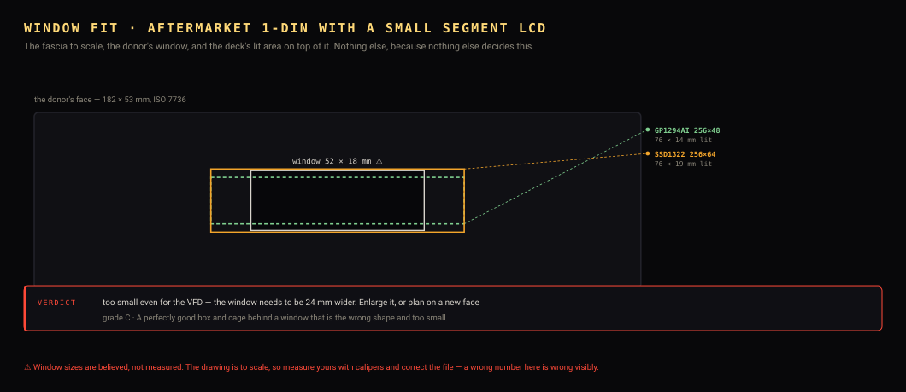

| | | |
|---|---|---|
| **What to pay** | ⚠️ £5–15 spares-or-repair | The cheapest and most plentiful category by a distance. |
| **Window width** | ⚠️ 52 mm | Typically around a third of the fascia. Measure. |
| **Window height** | ⚠️ 18 mm | Usually too short for a 256×64 panel. |
| **Chassis** | ⚠️ steel, ISO 7736, often shallower than the CD-era units | Mechless units are shallow, which can help in a tight dash and hurts nowhere. |
| **Cage** | ⚠️ usually |  |
| **Buttons** | ⚠️ typically 5–8, plus a knob | Enough for the ladder. |
| **Knob** | ⚠️ rotary, usually an encoder |  |
| **Its own display** | ⚠️ segment or small dot LCD, backlit | No inverter, so this is the SAFEST category to gut. |

### The front of it — the slot, the buttons, and the CD

| | | |
|---|---|---|
| **How the disc went in** | 📏 a visible slot across the face, typically ~125 × 12 mm | A CD is 120 mm across, so the slot cannot be narrower than about 122 mm. Height is whatever the dust lip needs — usually 10–14 mm. |
| **What it leaves behind** | 📏 yes — a full-width letterbox, and it is the best thing about this family | Everybody sees the slot as the problem. It is the solution. |
| **What to do with it** | ⚠️ ✅ MAKE THE SLOT THE WINDOW. File it DOWN from ~12 mm to 27 mm tall and blank the excess width behind the bezel | This is the insight that rescues the cheapest family in the project. Its own display window is ~52 × 18 mm — too small for a 256×64 panel, so you need a new aperture anyway. The slot is ALREADY 125 mm wide and dead straight; the deck needs 84 × 27. You are opening a hole downward by 15 mm in one axis instead of cutting a new rectangle in a fascia you cannot replace. Alternative if you would rather not: a row of buttons, or the aux and USB sockets, straight through the slot with no drilling. |
| **Can you keep the CD?** | ✅ ❌ no | As every other family. |
| **Its buttons** | ⚠️ 5–8, plus a knob — the fewest of any family, and just enough | The ladder wants six. Count them in the photograph before you buy, because this is the family where you might be one short. |

<sub>Why the CD cannot be driven by the deck, what the hole is worth, and the one route that keeps a working CD player: [REUSE.md](REUSE.md).</sub>

### Specific units to search for

| | Model | Years | Its own display | Notes |
|---|---|---|---|---|
| ✅ | **Sony CDX-GT / MEX series, later units** | ≈2008–2015 | segment LCD | Enormous numbers made, worthless broken, and a perfectly good steel box with a cage. The window is the problem, not the unit. |
| ✅ | **Pioneer DEH-1000 / DEH-2000 series** | ≈2008–2016 | segment LCD | Pioneer's budget line. The cheapest route to a chassis and cage in this entire document. |
| ✅ | **Kenwood KDC-100 / KDC-200 series** | ≈2010–2018 | segment LCD | As above. Mechless variants are shallower, which helps in a tight dash. |
| ✅ | **JVC KD-R series** | ≈2009–2016 | segment LCD | Common and cheap. Check the fascia is clipped rather than glued. |
| ✅ | **Any 'mechless' Bluetooth/USB 1-DIN receiver** | ≈2012–present | small segment LCD | ✅ The SAFEST donor of all — no CD laser, no VFD inverter, nothing charged. Shallow too. You are just going to cut the window. |

<sub>✅ buy it · ⚠️ workable, read the note · ❌ avoid for this build. Model names are ⚠️ researched, not handled.</sub>

### Keeping more of it

The strip-down above is the *simple* build. If you would rather keep as much as possible — and one of these is a part [BUILD.md](BUILD.md) otherwise tells you to buy — see [REUSE.md](REUSE.md).

| Part | Worth keeping for | Difficulty | |
|---|---|---|---|
| **the donor's own amplifier** | £12–20 and a part you would otherwise buy | medium | ⚠️ THE BIG ONE. Every CD-era head unit contains a 4-channel amplifier — usually a TDA7388, TDA7850 or similar — already bolted to the chassis as its heatsink and already wired to the ISO speaker connector. That is exactly the part BUILD.md tells you to go and buy. Cut the amp IC's four inputs free of the dead preamp and inject the deck's line out there instead. The IC datasheet gives the pinout; the mute/standby pin usually needs tying to its enable level, and that is the step people miss. |
| **the rear ISO connectors and aerial socket** | £8–15 of adapters, and a tidier back panel | easy | The donor's own ISO 10487 A and B blocks and its DIN aerial socket are already mounted in the back panel and already the standard shape. Keeping them means the deck plugs into the car's loom with no adapter and no flying leads out of a hole. |
| **the heatsink** | hard to buy in the right shape | easy | On most units the amplifier's heatsink IS part of the chassis casting. If you reuse the amp you get it for nothing; if you fit your own amp board, bolting it to the same casting is free cooling. |
| **the 12 V input protection** | a pound, and some peace of mind | easy | The reverse-polarity diode, the input fuse holder and the filter capacitors on the donor's power input are already rated for a car's supply. Cheap to buy, but they are already there and already fused. |
| **its own display** | none | not worth it | ❌ A segment LCD cannot show the deck's screens at all. This is the one case where the answer is simply no. |

### Stripping it down

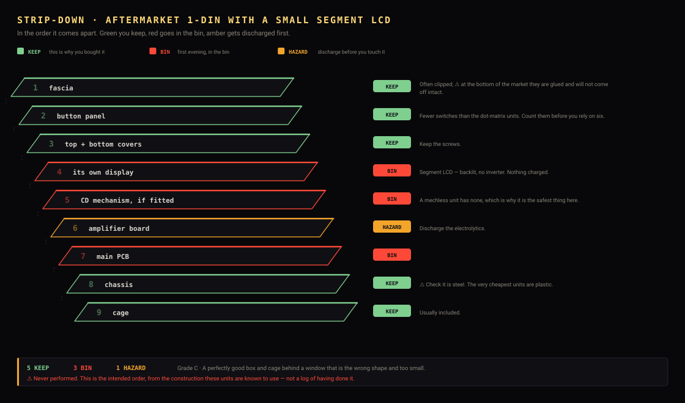

| | Part | | What happens to it |
|---|---|---|---|
| 1 | **fascia** | 🟩 **KEEP** | Often clipped; ⚠️ at the bottom of the market they are glued and will not come off intact. |
| 2 | **button panel** | 🟩 **KEEP** | Fewer switches than the dot-matrix units. Count them before you rely on six. |
| 3 | **top + bottom covers** | 🟩 **KEEP** | Keep the screws. |
| 4 | **its own display** | 🟥 BIN | Segment LCD — backlit, no inverter. Nothing charged. |
| 5 | **CD mechanism, if fitted** | 🟥 BIN | A mechless unit has none, which is why it is the safest thing here. |
| 6 | **amplifier board** | 🟧 **HAZARD** | Discharge the electrolytics. |
| 7 | **main PCB** | 🟥 BIN |  |
| 8 | **chassis** | 🟩 **KEEP** | ⚠️ Check it is steel. The very cheapest units are plastic. |
| 9 | **cage** | 🟩 **KEEP** | Usually included. |

**Why this one**

- Cheapest way to a chassis, a cage and a trim ring.
- No CD laser and no VFD inverter on a mechless unit — nothing in it is dangerous.
- Often shallower, which matters in a car with no room behind the dash.

**⚠️ Watch out for**

- ⚠️ The window will need enlarging, and a cut fascia is why home-built decks look home-built. Be honest about your ability to file a straight line before choosing this.
- Some very cheap units have a plastic chassis. Check for steel.
- Glued rather than clipped fascias appear at the bottom of the market and do not come off intact.

**How to gut it**

1. Same teardown as any 1-DIN unit — fascia first, keep the screws.
2. Decide honestly whether you are enlarging the window or replacing the face with acrylic. Both are fine; doing half of each is not.
3. If enlarging: mark from the PANEL, not from a measurement, and cut undersize then file to the line. Acrylic behind it hides a multitude.
4. If replacing: use the fascia only as a template for the clip positions and cut a new face from 3 mm acrylic.

---

## Adding a donor

Copy the nearest file in `donors/`, measure yours, run `python3 tools/donors/build.py` and `python3 tools/diagrams/donors.py`. Every dimension carries a confidence marker and `tools/verify/test_donors.py` fails on a claim without one.

**Measure the window with calipers, not from a photograph.** It is the one number that decides whether the build looks bought or looks made, and the drawing above is to scale — so a wrong number is wrong visibly.

