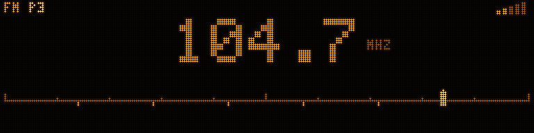

# Radio

**A head unit is a radio.** Everything else this deck does is something people
added to radios later, so the tuner gets a proper screen rather than an
afterthought.

The screen is written and you can look at it today, and so is the Si4735
driver — `firmware/esp32/main/deck_tuner.c`. The tuner hardware is researched
and specified. ⚠️ **Nothing here has been bought, wired, or tuned to a real
station.**

---

## 1. The screen

Ranked by what a driver actually needs, and given space in that order:

1. **The station.** RDS gives a name — `RADIO 1`, `CAPITAL` — and a name is
   what you tuned for. First and biggest.
2. **The frequency.** What you fall back on with no RDS, and what you say out
   loud. Big, but under the name.
3. **Where you are in the band.** A scale with a cursor, preset positions
   marked as stubs beneath it.
4. **Band, preset, signal, stereo.** Small, in the margins.
5. **RDS radio text.** The scrolling line. Last, because it is never urgent.

**With no RDS the frequency takes the big slot** rather than leaving a gap
where a name would have been. A weak station and a strong one should not have
layouts of different sizes.

### Two decisions worth naming

**The band scale is drawn, not implied.** A tuner without one feels broken
when you seek: the number jumps and nothing tells you whether you moved a
little or crossed the band. Six rows turns seeking from an event into a
movement, which is most of what a radio *feels* like.

**Signal and stereo are not drawn in brightness.** The obvious way to show a
weak signal is to dim something; that works on the OLED and vanishes on a
1-bit VFD where every level collapses to lit. So signal is a *count of
segments* and stereo is a *glyph that is present or absent*. Both survive.
See [UI-SPEC.md](UI-SPEC.md).

---

## 2. The tuner chip

| Part | Bands | RDS | ~Cost ⚠️ | Verdict |
|---|---|---|---|---|
| **Si4735** ✅ | FM, MW/AM, LW, SW | ✅ | £8–14 | **Buy this.** A DSP receiver, not an analogue front end with a PLL bolted on. FM *and* AM in one part, RDS, digital audio out, and the [PU2CLR library](https://github.com/pu2clr/SI4735) has 120+ functions and years of use behind it |
| Si4703 ✅ | FM only | ✅ | £5–8 | Fine, and cheaper, and FM only. Buy it if you will never want medium wave |
| RDA5807M | FM only | ✅ | £2–3 | Very cheap, widely cloned, noticeably worse sensitivity. For a bench toy, not a car |
| TEA5767 | FM only | ❌ | £2–3 | **No RDS.** Half this screen would be empty. Skip |
| **TEF6686** ⚠️ | FM, AM, and it is an SDR | ✅ | **$25–50** | **The upgrade path, not the starting point.** NXP's actual car-radio receiver — software-defined, with DSP, and reputedly in a different class for sensitivity and selectivity. I²C to an ESP32 exactly like the Si4735, and **open firmware and schematics** exist: [PE5PVB's project](https://github.com/PE5PVB/TEF6686_ESP32), written up by [IEEE Spectrum](https://spectrum.ieee.org/hacking-a-car-radio-chip). ⚠️ Two to four times the price, and **this project has no driver for it** — `deck_tuner.c` speaks AN332 to a Si4735 |

The Si4735 costs a few pounds more than the FM-only parts and gets you the
whole band structure, better sensitivity, and a station name on the screen.
On a build where the display is the point, that is not a close call.

**If the radio ever needs to be genuinely good rather than merely working**, the
TEF6686 is where to look — and unusually for this hobby, there is real working
code to read rather than a datasheet to guess from. It is a bigger job than
swapping a part: a new driver, a new command set, and none of the AN332 timing
work in `deck_tuner.c` carries over. Worth it only once the deck is finished and
the radio is the weakest thing about it.

⚠️ Nothing here has been bought or bench-tested.

### Wiring it

I²C for control, and the audio comes out either as analogue line level or as
I²S. Take the analogue output and feed it to the same amplifier the DAC feeds,
switched — see §4.

| Si4735 | ESP32 | Note |
|---|---|---|
| SDA | **GPIO 32** | I²C data |
| SCL | **GPIO 33** | I²C clock |
| RST | **GPIO 13** | the chip needs a hard reset to enter a mode |
| 3V3, GND | 3V3, GND | |
| LOUT / ROUT | the source switch, §4 | |

**Those three pins are the ones the button ladder frees.** A build with
discrete panel buttons has no room for a tuner; a build with the resistor
ladder has exactly enough. See [BUILD.md §3](BUILD.md#first-why-the-pins-are-where-they-are)
— this is the second time that ladder has paid for itself.

---

## 3. The aerial, which is where people get stuck

The chip is the easy half.

**The connector is a DIN plug** — the standard aftermarket "Motorola" aerial
connector, and every ISO-fitted car either has one or has an adapter for one.
✅ A car-specific adapter is £6–12.

**Many modern cars have an amplified aerial**, and it needs feeding. The
amplifier is in the aerial base, and it is powered by **12 V sent up the
centre core of the same coax** that carries the signal — "phantom power". A
factory aerial on an unpowered aftermarket head unit is deaf, and it looks
exactly like a broken tuner.

Two things to establish about *your* car before ordering:

| Question | If yes |
|---|---|
| Is the aerial amplified? | You need phantom power, or an adapter that injects it |
| Is the connector Fakra rather than DIN? | You need a **Fakra → DIN adapter with 12 V phantom power** — [InCarTec 21-123](https://incartec.co.uk/product/Fakra-to-Male-DIN-aerial-antenna-adapter-cable-With-12v-phantom-power-21-123) or equivalent, ~£12 ✅. These have a loose wire for the head unit's aerial-power output |

**On this deck, the aerial power feed is the switched 12 V rail** — the same
one the buck converter runs from, fused, switched by the ignition sense. A
real head unit has a separate "antenna/amp remote" output; here it is simpler
to take it off the switched rail, because the deck has nothing else that needs
a remote-turn-on line.

⚠️ **Do not connect 12 V to a bare tuner module's aerial input.** The Si4735's
RF pin expects a signal, not a supply. If you are injecting phantom power, do
it through an adapter designed for it, which has the DC-blocking capacitor and
the choke on the right sides.

**An S2000's aerial is a fixed mast on the rear wing** and is not amplified —
so on this specific car the phantom power question does not arise, and a plain
DIN adapter is enough. Verify on your own car before ordering.

---

## 4. Getting the audio out

The tuner produces analogue line level. The DAC produces analogue line level.
Only one should reach the amplifier at a time.

| Approach | Cost | Trade |
|---|---|---|
| **Analogue source switch** ✅ | £1 | A CD4053 or TS3A24159 analogue switch on a GPIO. The radio never touches the ESP32's audio path, so nothing is resampled and nothing is degraded. **Recommended** |
| Digitise it | £5 | Si4735's I²S output into the ESP32, so the tuner drives the spectrum analyser like everything else. Costs an I²S data pin and CPU |

The second is genuinely tempting — an analyser that goes flat the moment you
switch to radio is a strange thing on a deck built around an analyser. But it
needs a pin this build does not have spare, and the honest first version is
the switch. **If you want the analyser on radio, that is the reason to plan
for it early**, not something to retrofit.

---

## 5. Controls

Everything a tuner needs is already on the deck; nothing new has to be
invented.

| Action | Control |
|---|---|
| Tune | the encoder |
| Seek up / down | encoder held, or wheel next/prev |
| Band | **BAND** |
| Recall preset | **1**–**6** on the ladder, or the encoder push cycles |
| Store preset | hold a preset button |
| Source (BT ↔ radio ↔ aux) | **SRC** |

---

## 6. What is actually built

| Piece | State |
|---|---|
| The radio screen, in portable C | ✅ **Written**, rendered, in the media pipeline |
| `deck_radio_t`, the state it reads | ✅ Written |
| Chip choice, wiring, aerial | ✅ Researched with part numbers, ⚠️ nothing bought |
| Region: band plan, step, de-emphasis, RDS/RBDS | ✅ **Written** — five plans, stored in NVS, set once. See below |
| Si4735 driver in the firmware | ✅ **Written** — `main/deck_tuner.c`. I²C init, address probe, band/tune/seek, RSSI, RDS decode |
| Presets, kept across a power cycle | ✅ Written — six per band, in NVS |
| Source switching | ✅ Written — `main/deck_source.c`, a 74HC4052 on GPIO 2 and 12 |
| Anything on hardware | ❌ Never |

⚠️ **"Written" means written and compiling.** No Si4735 has been on the end of
it. The pieces most likely to need work on a bench are the 120 ms settling
wait after `POWER_UP` and the RDS group filtering — both are from AN332 rather
than from a scope.

The command sequences came from the datasheet and AN332. The PU2CLR library is
Arduino C++ and the deck is C99 freestanding, so it was a reference for
sanity-checking sequences rather than a dependency — nothing is vendored from
it and the deck does not link against it.

### Region — and it follows the postcode, not the badge

The band plan is not universal, and the deck now carries five: **EU, UK, US,
JP and AU**. It is stored in NVS and set once (`deck_tuner_region_set()`).

| | FM | AM step | De-emphasis |
|---|---|---|---|
| EU / UK | 87.5–108, 100 kHz | 9 kHz | 50 µs |
| US | 87.9–107.9, **200 kHz** | **10 kHz** | **75 µs** |
| JP | **76–95**, 100 kHz | 9 kHz | 50 µs |
| AU | 87.5–108, 100 kHz | 9 kHz | 50 µs |

⚠️ **It follows where the deck is DRIVEN, not where the car was built.** A JDM
import in Britain receives British stations, so it wants the European plan.
Everything *else* about fitting a deck to an import — fascia, harness, aerial
plug — follows the car's market. This is the one people get backwards; see
[VEHICLES.md](VEHICLES.md).

Wrong, and it fails in ways that do not look like a settings mistake:

- **Japan's FM band does not overlap Europe's below 87.5 MHz.** A European deck
  driven in Japan can tune roughly a tenth of the band and finds almost nothing
  — which looks exactly like a dead aerial.
- **The Americas use 10 kHz AM spacing against 9 kHz elsewhere.** On the wrong
  step every station lands between channels and the whole band sounds
  mistuned, because it is.
- **US FM sits on odd tenths on a 200 kHz raster**, so a 100 kHz step offers
  twice as many channels as exist and half of them are empty.
- **De-emphasis is 75 µs in the Americas and 50 µs elsewhere.** Wrong, and the
  radio still works — just dull or hissy. Nobody ever suspects it.

Changing region drags the saved frequencies and every preset into the new
plan. Skipping that leaves a deck showing 88.1 in Japan: a frequency the chip
accepts, tunes to, and receives nothing on.

Three implementation notes that will save someone an afternoon:

- **Both addresses are probed.** The Si4735 answers on 0x11 or 0x63 depending
  on how its `SEN` pin was strapped, and breakout boards disagree about which.
  The driver tries 0x11, then 0x63, and logs which one answered along with the
  part number it read back.
- **Frequency units differ per band.** FM is in 10 kHz units and AM in 1 kHz
  units, which is a datasheet fact and not a typo; `apply_tune()` converts from
  the kHz the UI works in. Getting this wrong tunes you to a tenth of the band.
- **The driver reads the frequency back** on its 100 ms poll rather than
  assuming the chip is where it was put. Hardware seek moves it on its own, and
  a display that shows the requested frequency instead of the actual one is
  wrong exactly when it matters.
