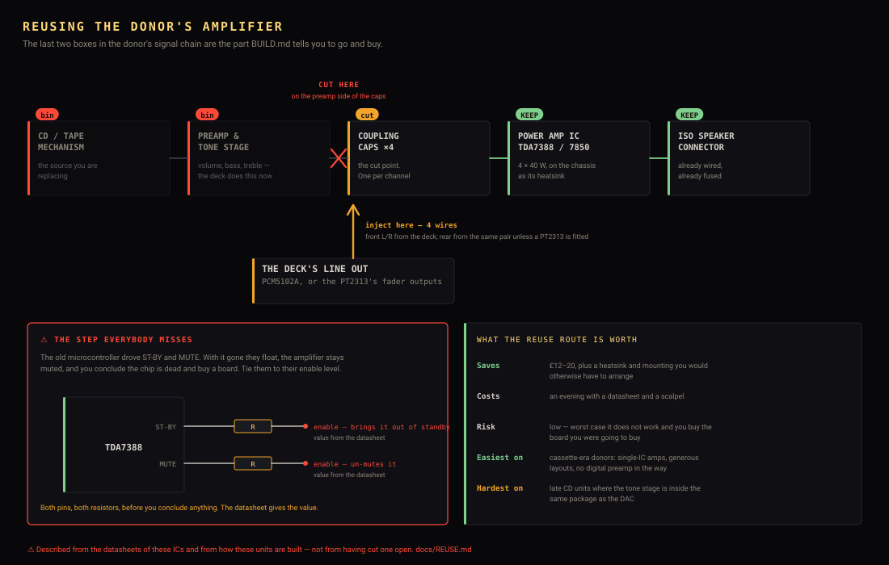
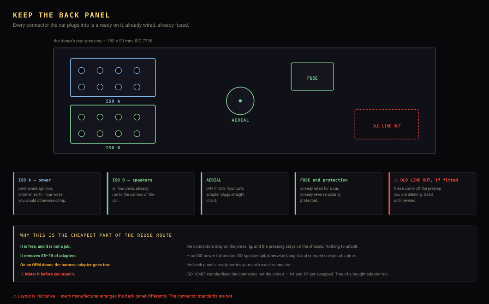

# Keeping as much of the donor as you can

[DONORS.md](DONORS.md) describes the **simple** build: keep the box, the face,
the cage, the buttons and the knob, and bin the rest on the first evening. That
is the right default, and it is what the strip-down drawings show.

This page is for the other approach — **keep everything you possibly can** —
and it is not just sentiment. One of the parts the default throws away is a
part [BUILD.md](BUILD.md) then tells you to go out and buy.

---

## The one that actually matters: the donor already has an amplifier

**Every CD-era head unit contains a 4-channel amplifier.** Usually a TDA7388,
a TDA7850 or something from the same family — the exact ICs BUILD.md
recommends you buy a board of. In the donor it is already:

- bolted to the chassis casting, which is already its heatsink
- wired to the ISO speaker connector on the back panel
- fed from the car's 12 V through protection that already exists
- fused

So the default build bins a £12–20 part, and then buys the same part again.

### How to reuse it

The amplifier IC sits at the end of a signal chain you are deleting. The job is
to cut its inputs free of the dead preamp and feed them the deck's line out
instead.

1. **Identify the IC.** The part number is printed on it. Find its datasheet —
   these are all common parts and all documented.
2. **Find the four input pins** from the pinout. They will have a coupling
   capacitor each, fed from the old preamp or tone stage.
3. **Cut the track** on the preamp side of those capacitors, or lift the
   capacitor's input leg.
4. **Inject the deck's line out** there — front left and right from the deck's
   two channels, and rear from the same pair unless you have fitted a PT2313,
   in which case take the fader outputs.
5. ⚠️ **Deal with the mute and standby pins.** This is the step people miss.
   Most automotive amp ICs have a `ST-BY` and a `MUTE` pin that the old
   microcontroller drove, and with that microcontroller gone they float — so
   the amplifier stays muted and you conclude it is dead. Tie them to their
   enable level through the resistor the datasheet specifies.
6. **Leave the speaker outputs and the power input alone.** They already go
   where they should.

### What it is worth

| | |
|---|---|
| **Saves** | £12–20, plus a heatsink and mounting you would have to arrange |
| **Costs** | An evening with a datasheet and a scalpel |
| **Risk** | Low. The worst case is that it does not work and you buy the board you were going to buy anyway |

**The cassette-era units are the easiest of all**, because their amplifiers are
discrete or single-IC with generous layouts and no digital preamp in the way —
the tape head fed them almost directly. If maximum reuse is the goal, that is
the family to choose.

---

## The rest, in order of what it saves

The back panel is the easiest win in the whole project, because keeping it is
**not a job**: the connectors stay on the pressing, and the pressing stays on
the chassis you are keeping anyway.

| Part | Saves | Difficulty |
|---|---|---|
| **The rear ISO connectors and aerial socket** | £8–15 of adapters | easy |
| **The heatsink** | Hard to buy in the right shape; usually part of the casting | easy |
| **The 12 V input protection** | A pound, and it is already fused and rated for a car | easy |
| **The illumination bulbs and light pipes** | The period look. Swap the bulbs for amber LEDs and keep the diffusers | easy |
| **The IR receiver**, if it had one | £1 and a clear line of sight already drilled | easy |
| **The car-specific connector** — OEM donors only | The harness adapter, entirely | easy |

That last one is worth calling out: on an **OEM donor from your own car**, the
back panel already carries your car's exact connector. Keep it and there is no
harness adapter to buy at all. The fascia usually gets all the credit for the
OEM route; the connector deserves half of it.

---

## The display, honestly

This is the one everybody wants and the one that usually does not work. It is
worth understanding *why*, because the reason decides whether yours is the
exception.

**Most head-unit displays are segment or character devices.** Fixed shapes,
seven-segment digits, a few 5×7 character cells and a lot of dedicated icons.
They are wired to show a frequency and a track number and nothing else. A
256×64 graphic screen cannot be drawn on them at any effort — there are no
pixels to address. ❌

**A genuine graphic dot-matrix panel can, in principle.** But two things get in
the way. The controller is usually undocumented and often custom to the
manufacturer. And the resolution is frequently **128×32** — half the deck's
width and half its height — which would need a new layout tier in `core/`, not
just a driver.

**✅ The exception, and it is a real one:** if the donor's panel turns out to be
a **Futaba GP1294AI**, the firmware already has a driver for it. Those panels
are commonly sold as pulls from car radios, which is exactly where yours would
be coming from. Check the part number on the glass or its flexi before
assuming anything — this is the one case where the answer is yes and the work
is already done.

⚠️ And the standing hazard: a VFD's power board makes its own filament and
anode supplies, tens of volts, held on a capacitor after power-off. Reusing the
panel means keeping that board alive rather than binning it, so the caution
applies for longer.

---

## What this changes about the shopping list

If you reuse the donor's amplifier and connectors, the "to make a sound"
section of [BUILD.md](BUILD.md) drops to **£0** and the car-side wiring gets
simpler rather than harder, because the back panel is already right.

That makes the **cassette-era donor** the cheapest complete route in this
project: a £5–15 unit, often free from a scrapyard, containing a chassis, a
face, an amplifier, a heatsink, connectors, and knobs that are nicer than
anything you can buy.

---

⚠️ **None of this has been done.** The amplifier reuse in particular is
described from the datasheets of the ICs involved and from how these units are
built, not from having cut one open. The mute/standby detail is the one most
likely to bite, which is why it has a numbered step of its own.
